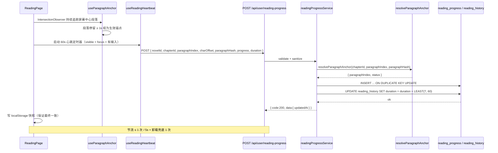
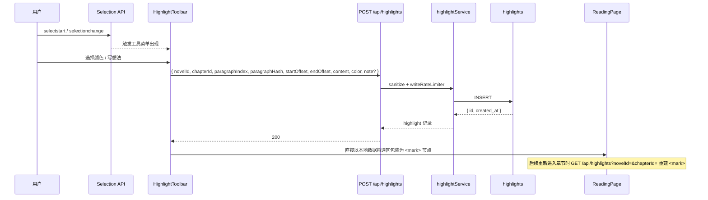
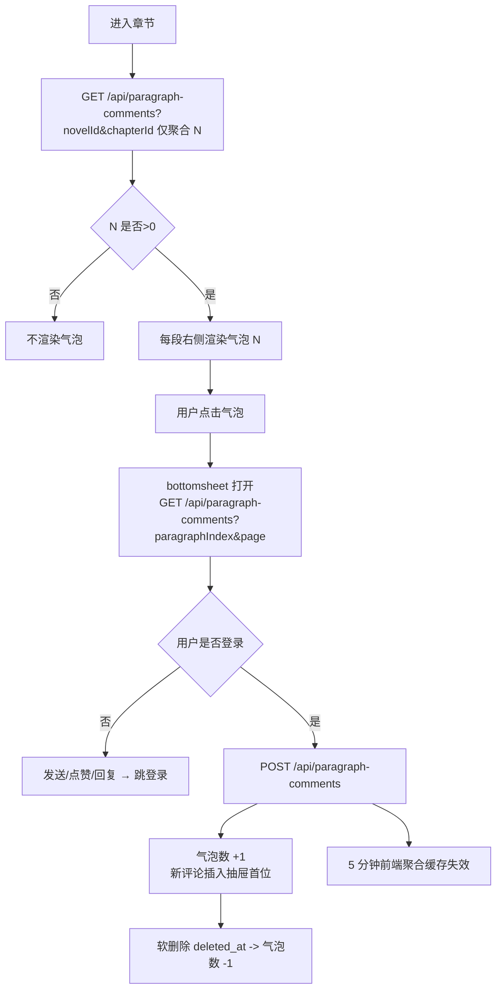
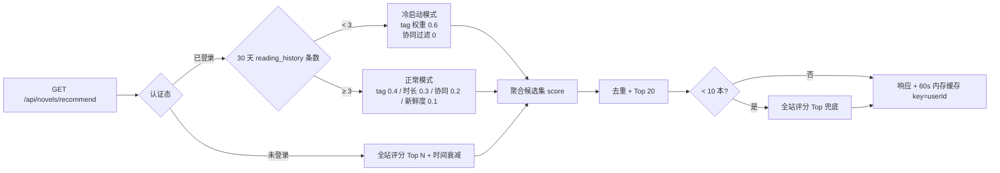
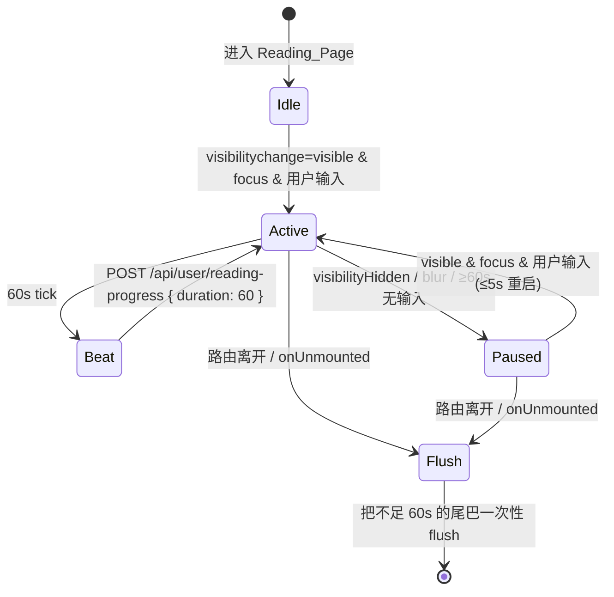
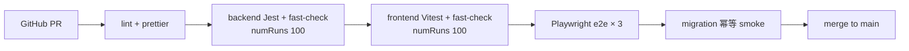
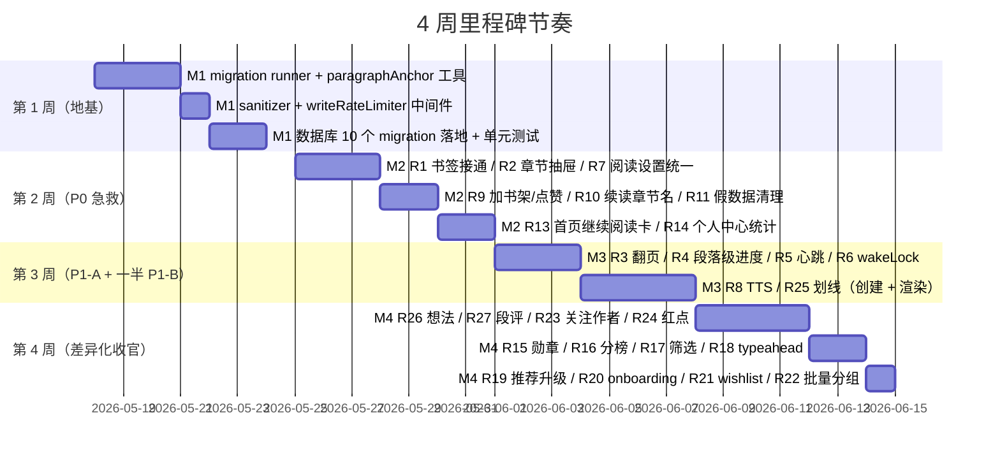

# Design Document

> 中文标题：微信读书 / 晋江对标升级 — 设计文档
> 文档日期：2026-05-17
> Spec 名称：wechat-jjwxc-parity-upgrade
> 类型：Feature
> 关联文档：`./requirements.md`、`docs/项目总文档/2026-05-17-用户体验对标微信读书晋江-优化计划清单.md`

## Overview

本设计文档把 `requirements.md` 中 9 个模块、37 条 Requirement、约 200 条 Acceptance Criteria 转化为可落地的工程方案。整体目标是在 **不引入新框架、不重写既有架构** 的前提下，把现有 Vue 3 用户前端 (`ai-xsread-vue3/`) 与 Express 用户后端 (`backend/`) 升级到一个能与"微信读书 / 晋江"重度读者使用习惯对齐的体验门槛。管理端 (`admin-frontend/`、`admin-backend/`) 不在本次升级范围内。

### 设计目标

1. **段落级精度的阅读上下文**：进度同步、书签、划线、段评统一使用段落锚点三元组 `(chapterId, paragraphIndex, paragraphHash)`，由后端共享 helper `resolveParagraphAnchor` 兜底锚点漂移（Requirement 29）。
2. **唯一的 schema 事实来源**：把 `commentController.ensureCommentTables` 等运行时建表逻辑移除，迁移到 `backend/database/migrations/` 下的 `YYYYMMDDHHmm__description.sql` 文件，通过启动期顺序执行 + `migrations` 元数据表保证幂等（Requirement 30）。
3. **向后兼容窗口 6 个月**：所有新字段以 `NULL` 形式新增；老接口字段（如 `reading_progress.progress`）在过渡期内由新版前端协同写入；新接口（highlights / paragraph-comments）对未升级客户端返回 404 而非 500（Requirement 31）。
4. **写接口共享安全护栏**：抽出 `sanitizeText` 与 `writeRateLimiter` 工具，所有用户文本写入路径强制走清洗 + 频次限制（Requirement 34）。
5. **女性向产品调性**：默认排序使用 `Interaction_Quality_Score = likes + replyCount × 2 + min(content_length / 50, 5)`，所有新增动效遵守 `prefers-reduced-motion` 与 ≤ 1.5s 时长上限（Requirement 35）。
6. **不破坏现有响应式 / 移动端布局**：新增组件在 360px / 412px / 768px / 1024px / 1440px 五档断点下手动验证；所有新增可点击元素 ≥ 32×32px（Requirement 36）。

### 范围摘要

- 用户前端：新增 / 改造 14 个视图与 ≥ 20 个组件、≥ 8 个 composable；
- 用户后端：新增 / 改造 12 个路由、9 个 service、新增 migration 子系统、新增段落锚点与速率限制工具；
- 数据库：新增 6 张表、扩展 3 张表、追加 1 个枚举值；
- 测试：≥ 30 条 PBT、≥ 20 条单元 / 集成测试、3 条 Playwright e2e。

## 已有代码基线快照

下表是设计阶段假定的项目基线（来自 `docs/AI完成后报告文档/2026-05-16-项目现状分析报告.md`）：

| 子项 | 现状 | 本次设计的接管点 |
|---|---|---|
| 用户前端 14 个页面 | 全部已建立，含 ReadingPage / NovelDetailPage / ProfilePage / HomePage / SearchPage / BookshelfPage | 在原文件基础上做"接通真实接口 + 抽 composable"，单文件控制在 1000 行内 |
| 阅读组件 9 个 | 含 ChapterDrawer / SettingPanel / ReadingPresets | 复用 ChapterDrawer，把 SettingPanel 接到 `useReadingSettings` 单一来源 |
| 用户后端 7 个路由模块 | auth / novels / chapters / user / comments / upload / authors | 新增 highlights / paragraph-comments / bookmarks / interest-tags / achievements；扩展 user / novels / authors |
| 数据库 12 张表 | users / novels / chapters / categories / bookshelf / reading_progress / reading_history / user_likes / comments / tags / novel_tags / system_config | 新增 6 张，扩展 3 张，新增 migrations 元数据表 |
| 评论系统 | `commentController.ensureCommentTables` 在请求 handler 中执行 `CREATE TABLE IF NOT EXISTS` | 全量迁移到 migration 文件，handler 中删除该副作用 |
| Redis | 已引入依赖未充分使用 | 仅用作"段评气泡数 / typeahead suggestions / recommend"短缓存，不引入新的会话依赖 |

## Architecture

### 总体架构图

```mermaid
flowchart LR
    subgraph FE[Vue 3 用户前端 :3008]
        FE_Reading[ReadingPage]
        FE_Detail[NovelDetailPage]
        FE_Home[HomePage]
        FE_Bookshelf[BookshelfPage]
        FE_Profile[ProfilePage]
        FE_Search[SearchPage]
        FE_Onboard[OnboardingInterestsPage]
        FE_Achieve[AchievementsPage]
        FE_Author[AuthorPage]
        FE_API[api/* 封装]
        FE_Comp[composables/*]
        FE_Store[stores/* Pinia]
        FE_Reading --> FE_Comp
        FE_Detail --> FE_API
        FE_Home --> FE_API
        FE_Bookshelf --> FE_Store
        FE_Profile --> FE_API
        FE_Comp --> FE_API
        FE_Store --> FE_API
    end

    subgraph BE[Express 用户后端 :8005]
        BE_Auth[/auth]
        BE_User[/user]
        BE_Novel[/novels]
        BE_Author[/authors]
        BE_Highlight[/highlights]
        BE_PC[/paragraph-comments]
        BE_Bookmark[/user/bookmarks]
        BE_Interest[/user/interest-tags]
        BE_Achieve[/user/achievements]
        BE_Health[/health]
        BE_Service[services/*]
        BE_Util[utils/*]
        BE_Migrate[migrations/*]
        BE_Auth & BE_User & BE_Novel & BE_Author & BE_Highlight & BE_PC & BE_Bookmark & BE_Interest & BE_Achieve --> BE_Service
        BE_Service --> BE_Util
    end

    subgraph DB[(MySQL 8.0 ai_xsread)]
        T_Users[users]
        T_Novels[novels]
        T_Chapters[chapters + paragraph_hashes]
        T_Bookshelf[bookshelf 扩展]
        T_RP[reading_progress 扩展]
        T_RH[reading_history]
        T_BM[user_bookmarks]
        T_HL[highlights]
        T_PC[paragraph_comments]
        T_FA[user_follow_authors]
        T_IT[user_interest_tags]
        T_AC[user_achievements]
        T_MIG[migrations]
    end

    Cache[(Redis 短缓存)]

    FE -->|/api fetch| BE
    BE_Service --> DB
    BE_Service --> Cache
    BE_Migrate -.启动期顺序执行.-> DB
```

### 技术栈与版本不变项

- Vue 3.5 + Vite 7 + Pinia 3.0 + TailwindCSS 3.4，新增组件继续使用 `<script setup>`；
- Express 4.18 + MySQL2 3.6 + JWT，沿用 `{ code, message, data, timestamp }` 响应格式；
- MySQL 8.0 / utf8mb4 / utf8mb4_unicode_ci；
- 不引入新的 ORM、不引入新的状态库、不引入新的 UI 库；
- 段落 hash 算法：Node `crypto.createHash('sha1').update(text.slice(0,50)).digest('hex').slice(0,16)`，前后端同源实现以保证完全一致。

### 模块边界与职责划分

| 模块 | 主要职责 | 关键文件 / 目录 |
|---|---|---|
| 阅读核心 | 翻页、设置、心跳、wakeLock、TTS、目录抽屉 | `views/ReadingPage.vue`, `composables/useReadingSettings.js`, `composables/useReadingHeartbeat.js`, `composables/useTTS.js`, `composables/useWakeLock.js`, `composables/useParagraphAnchor.js` |
| 内容 / 详情 | 加书架 / 点赞 / 续读 / 同作者 / 同标签 | `views/NovelDetailPage.vue`, `api/novels.js`, `api/authors.js` |
| 个人中心 | 统计、勋章、关注作者、想法 / 划线列表 | `views/ProfilePage.vue`, `views/AchievementsPage.vue`, `composables/useUserStats.js` |
| 首页 / 发现 | Hero、分榜 Tab、推荐流、Onboarding | `views/HomePage.vue`, `views/OnboardingInterestsPage.vue` |
| 搜索 | typeahead、筛选、URL 同步 | `views/SearchPage.vue`, `components/EnhancedSearchBar.vue` |
| 书架 | wishlist、分组、批量、置顶、红点 | `views/BookshelfPage.vue`, `stores/bookshelfStore.js` |
| 划线 / 想法 / 段评 | 工具菜单、bottomsheet、气泡 | `components/reading/HighlightToolbar.vue`, `components/reading/NoteSheet.vue`, `components/reading/ParagraphCommentBubble.vue`, `components/reading/ParagraphCommentSheet.vue` |
| 后端基础设施 | migration runner、`resolveParagraphAnchor`、`sanitizeText`、`writeRateLimiter` | `backend/src/utils/paragraphAnchor.js`, `backend/src/utils/sanitizer.js`, `backend/src/middlewares/writeRateLimiter.js`, `backend/database/migrate.js` |

### 启动期初始化时序

```mermaid
sequenceDiagram
    participant App as backend/src/app.js
    participant Mig as database/migrate.js
    participant DB as MySQL
    participant HTTP as Express HTTP Server

    App->>Mig: runPendingMigrations()
    Mig->>DB: SELECT version FROM migrations ORDER BY version
    DB-->>Mig: 已执行版本集合
    Mig->>Mig: 扫描 database/migrations/*.sql 按文件名排序
    loop 每个未执行的 migration
        Mig->>DB: BEGIN; <SQL>; INSERT INTO migrations(version, applied_at); COMMIT;
        DB-->>Mig: 成功 / 失败
        alt 失败
            Mig-->>App: throw MigrationError
            App-->>App: process.exit(1) 拒绝启动 HTTP
        end
    end
    Mig-->>App: { applied: [...], skipped: [...] }
    App->>HTTP: app.listen(8005)
```

> 该流程把 Requirement 30.4（migration 失败拒绝启动）与 Requirement 37.3（`/api/health` 响应包含 migration 版本号）作为强约束。

### 段落级进度同步时序



### 划线创建与渲染时序



### 段评气泡生命周期



### 推荐管线（含冷启动）



### 心跳生命周期



> 心跳生命周期严格对应 Requirement 5.1–5.6；`useReadingHeartbeat` 内部维护 4 种事件的合流（`visibilitychange`、`focus`/`blur`、`scroll/touch/click`、`onUnmounted`）。

## Components and Interfaces

本节按"前端组件 / composable"、"后端路由 / service / 工具"两条线列举本次新增 / 改造的最小集合。命名遵循现有项目风格（PascalCase 文件 + `useXxx` composable + `xxxService` / `xxxController`）。

### 前端：视图（views）

| 视图 | 文件 | 关联 Requirement | 主要职责 |
|---|---|---|---|
| 阅读页 | `views/ReadingPage.vue` | 1, 2, 3, 4, 5, 6, 7, 8, 25, 26, 27 | 翻页、设置、心跳、wakeLock、TTS、目录、书签、划线、想法、段评 |
| 详情页 | `views/NovelDetailPage.vue` | 9, 10, 11, 12, 26, 28 | 加书架 / 点赞 / 续读 / 真实评分 / 同作者 / 同标签 / 读者想法 |
| 首页 | `views/HomePage.vue` | 13, 16 | 继续阅读卡 + 分榜 Tab |
| 个人中心 | `views/ProfilePage.vue` | 14, 15, 23, 25, 26, 28 | 真实统计 + 勋章入口 + 关注作者 + 我的想法 / 划线 |
| 勋章页 | `views/AchievementsPage.vue` (新增) | 15 | 已解锁 / 未解锁分组 + 进度条 |
| 书架页 | `views/BookshelfPage.vue` | 21, 22, 24 | wishlist Tab + 分组 + 批量 + 排序 + 红点 |
| 搜索页 | `views/SearchPage.vue` | 17, 18 | 筛选条 + typeahead + URL 同步 |
| 作者页 | `views/AuthorPage.vue` | 12, 23, 28 | 作者主页 + 作品列表 + 关注 |
| 注册引导 | `views/OnboardingInterestsPage.vue` (新增) | 20 | 选 ≥ 1 个兴趣标签 + 跳过 |
| 关注作者列表 | `views/FollowingAuthorsPage.vue` (新增) | 23, 28 | 全部关注作者分页列表 |
| 我的划线 | `views/MyHighlightsPage.vue` (新增) | 25 | 划线列表 + 跳转 |
| 我的想法 | `views/MyNotesPage.vue` (新增) | 26 | 想法列表 + 跳转 |
| 我的书签 | `views/MyBookmarksPage.vue` (新增) | 1 | 书签列表 + 跳转 |

### 前端：阅读相关组件（components/reading/）

| 组件 | 文件 | 复用 / 新增 | 关联 Requirement |
|---|---|---|---|
| ChapterDrawer | `ChapterDrawer.vue` | 复用 + 增强（按需分页 + 搜索） | 2 |
| SettingPanel | `SettingPanel.vue` | 重写为 `useReadingSettings` 单一来源 | 3, 6, 7 |
| HighlightToolbar | `HighlightToolbar.vue` | 新增（选区悬浮工具菜单） | 25 |
| NoteSheet | `NoteSheet.vue` | 新增（想法 bottomsheet） | 26 |
| ParagraphCommentBubble | `ParagraphCommentBubble.vue` | 新增（段评气泡） | 27 |
| ParagraphCommentSheet | `ParagraphCommentSheet.vue` | 新增（段评抽屉） | 27 |
| TTSControlBar | `TTSControlBar.vue` | 新增（朗读控制条） | 8 |
| BookmarkSheet | `BookmarkSheet.vue` | 新增（我的书签抽屉） | 1 |
| PageFlipController | `PageFlipController.vue` | 新增（管理 scroll/tap/swipe） | 3 |

### 前端：通用 / 业务组件（components/...）

| 组件 | 关联 Requirement |
|---|---|
| `components/common/EnhancedSearchBar.vue`（typeahead + 历史） | 18 |
| `components/novel/RankTabSection.vue`（首页分榜） | 16 |
| `components/novel/SearchFilterPanel.vue` | 17 |
| `components/novel/SameAuthorRail.vue` / `SameTagRail.vue` | 12 |
| `components/novel/HotNotesSection.vue`（详情页读者想法） | 26 |
| `components/profile/StatsHeader.vue`（书架 / 连读 / 时长） | 14 |
| `components/profile/WeekBarChart.vue` | 14 |
| `components/profile/AchievementCard.vue` | 15 |
| `components/profile/FollowingAuthorList.vue` | 23, 28 |
| `components/bookshelf/BookshelfTabBar.vue`（含 wishlist） | 21 |
| `components/bookshelf/BatchActionBar.vue` | 22 |
| `components/bookshelf/GroupSelector.vue` | 22 |
| `components/bookshelf/UnreadBadge.vue` | 24 |

### 前端：composables（src/composables/）

| Composable | 主要 API | 关联 Requirement |
|---|---|---|
| `useParagraphAnchor` | `track(el)`, `currentAnchor.value`, `restore(anchor)` — 内部封装 IntersectionObserver + paragraphHash 计算 | 4, 25, 27, 29 |
| `useReadingHeartbeat` | `start()`, `stop()`, `flush()` — 60s tick + visibility/focus/idle 合流 | 5 |
| `useWakeLock` | `request()`, `release()`，自动响应 `visibilitychange` | 6 |
| `useReadingSettings` | 单一阅读偏好来源（字号 / 行距 / 段距 / 页边距 / 字体 / 亮度 / pageFlipMode），返回 `settings` reactive、`reset()`、`save()` | 3, 6, 7 |
| `usePageFlip` | 根据 `settings.pageFlipMode` 派发 scroll / tap / swipe 行为 | 3 |
| `useTTS` | `play()`, `pause()`, `next()`, `prev()`, `stop()`、当前段落高亮 | 8 |
| `useHighlightToolbar` | 监听 `selectionchange` + 工具菜单坐标计算 + 多端兼容 | 25 |
| `useParagraphCommentBubble` | 段评聚合数缓存（5 分钟） | 27 |
| `useReadingHistoryEntry` | 提供"继续阅读"卡片所需聚合数据 | 13 |
| `useUserStats` | 统计 / 周柱 / 加入天数 | 14 |
| `useAchievements` | 拉取 + 新解锁动效（仅离开 ReadingPage 后回放） | 15 |
| `useFollowAuthor` | 关注 / 取消关注 + 状态缓存 | 23, 28 |
| `useReturnUrl` | 统一处理登录跳转 / 同源 returnUrl 校验 | 32 |

### 前端：API 封装（src/api/）

新增 / 扩展模块：

- `api/bookmarks.js`：`createBookmark`, `listMyBookmarks`, `listNovelBookmarks`, `deleteBookmark`
- `api/highlights.js`：`createHighlight`, `listChapterHighlights`, `listMyHighlights`, `updateHighlight`, `deleteHighlight`
- `api/paragraphComments.js`：`getAggregatedCount`, `listByParagraph`, `create`, `like`, `unlike`, `remove`
- `api/authors.js`：`getAuthor`, `listAuthorNovels`, `followAuthor`, `unfollowAuthor`, `listFollowingAuthors`
- `api/interestTags.js`：`saveTags`, `getMyTags`
- `api/achievements.js`：`listAchievements`
- `api/notes.js`：`listMyNotes`, `listHotNotesForNovel`
- `api/recommend.js`：`getRecommend`
- `api/readingProgress.js` 扩展：增加 `paragraphIndex / paragraphHash / charOffset / duration`
- `api/bookshelf.js` 扩展：增加 `type=wishlist`、`group_name`、`batch`、`sortBy`
- `api/novels.js` 扩展：`tags`、`wordCountMin/Max`、`ratingMin`、`hasFinished`、`sortBy`、`exclude`

所有 API 模块继续使用现有 `request` 封装，响应假定 `{ code, message, data, timestamp }`，401 由全局拦截器统一处理（Requirement 32.4）。

### 前端：Pinia stores

| Store | 状态 | 关联 Requirement |
|---|---|---|
| `stores/userStore.js` | 用户基础信息、`hasInterestTags` | 20, 32 |
| `stores/bookshelfStore.js` | 书架列表（含 wishlist / 分组 / 红点） | 21, 22, 24 |
| `stores/readingSettingsStore.js`（替代 `xs-reading-prefs-v2`） | 阅读偏好统一来源 | 7 |
| `stores/readingProgressStore.js` | 当前阅读上下文（`(novelId, chapterId, paragraphIndex, charOffset, paragraphHash)`） | 4 |
| `stores/highlightsStore.js` | 章节级划线缓存 | 25 |
| `stores/paragraphCommentsStore.js` | 段评聚合数缓存（5 分钟 TTL） | 27 |
| `stores/recommendationStore.js` | 分榜 / 推荐结果缓存（5 分钟 TTL） | 16, 19 |

### 后端：路由与控制器

> 所有新增路由统一前缀 `/api`，统一错误码格式 `{ code, message, data, timestamp }`。需要登录的接口在 401 时返回 `{ code: 401, message: '请先登录' }`（Requirement 32.4）。

| Method | Path | Controller | 关联 Requirement |
|---|---|---|---|
| GET | `/api/health` | `healthController.status` | 37.3 |
| GET | `/api/user/reading-progress/:novelId` | `userController.getProgress` | 4, 10, 13, 31 |
| POST | `/api/user/reading-progress` | `userController.updateProgress` | 4, 5, 31 |
| GET | `/api/user/reading-history` | `userController.listHistory` | 13 |
| GET | `/api/user/statistics` | `userController.getStatistics` | 14 |
| GET | `/api/user/bookshelf` | `userController.listBookshelf` | 9, 22, 24 |
| POST | `/api/user/bookshelf` | `userController.addBookshelf` | 9, 21 |
| POST | `/api/user/bookshelf/batch` | `userController.batchBookshelf` | 22 |
| DELETE | `/api/user/bookshelf/:novelId` | `userController.removeBookshelf` | 9, 22 |
| GET | `/api/user/bookmarks` | `bookmarkController.listMine` | 1 |
| POST | `/api/user/bookmarks` | `bookmarkController.create` | 1 |
| DELETE | `/api/user/bookmarks/:id` | `bookmarkController.remove` | 1 |
| GET | `/api/user/highlights` | `highlightController.listMine` | 25 |
| GET | `/api/user/notes` | `highlightController.listMyNotes` | 26 |
| POST | `/api/highlights` | `highlightController.create` | 25, 26 |
| GET | `/api/highlights` | `highlightController.listByChapter` | 25 |
| PATCH | `/api/highlights/:id` | `highlightController.update` | 25, 26 |
| DELETE | `/api/highlights/:id` | `highlightController.remove` | 25 |
| GET | `/api/novels/:novelId/notes/hot` | `highlightController.listHotForNovel` | 26 |
| GET | `/api/paragraph-comments` | `paragraphCommentController.list` | 27 |
| POST | `/api/paragraph-comments` | `paragraphCommentController.create` | 27 |
| POST | `/api/paragraph-comments/:id/like` | `paragraphCommentController.like` | 27 |
| DELETE | `/api/paragraph-comments/:id/like` | `paragraphCommentController.unlike` | 27 |
| DELETE | `/api/paragraph-comments/:id` | `paragraphCommentController.remove` | 27 |
| GET | `/api/novels/:id` | `novelController.detail` | 11, 12 |
| GET | `/api/novels/:id/status` | `novelController.likeAndShelfStatus` | 9 |
| GET | `/api/novels/:id/rating` | `novelController.ratingDistribution` | 11 |
| POST | `/api/novels/:id/like` | `novelController.like` | 9 |
| DELETE | `/api/novels/:id/like` | `novelController.unlike` | 9 |
| GET | `/api/novels` | `novelController.list` | 12, 16, 17, 19 |
| GET | `/api/novels/search` | `novelController.search` | 17 |
| GET | `/api/novels/search/suggestions` | `novelController.suggestions` | 18 |
| GET | `/api/novels/recommend` | `novelController.recommend` | 19 |
| GET | `/api/novels/:novelId/chapters` | `chapterController.list` | 2 |
| GET | `/api/authors/:authorId` | `authorController.detail` | 23, 28 |
| GET | `/api/authors/:authorId/novels` | `authorController.novels` | 12, 28 |
| POST | `/api/authors/:authorId/follow` | `authorController.follow` | 23 |
| DELETE | `/api/authors/:authorId/follow` | `authorController.unfollow` | 23 |
| GET | `/api/user/following-authors` | `authorController.listFollowing` | 23, 28 |
| POST | `/api/user/interest-tags` | `interestTagController.save` | 19, 20 |
| GET | `/api/user/interest-tags` | `interestTagController.list` | 19, 20 |
| GET | `/api/user/achievements` | `achievementController.list` | 15 |

### 后端：service 层（backend/src/services/）

| Service | 主要方法 | 关联 Requirement |
|---|---|---|
| `readingProgressService` | `getProgress`, `updateProgress`（含心跳合流 + paragraph anchor + duration cap） | 4, 5, 31 |
| `bookmarkService` | `create`, `listByUser`, `listByNovel`, `remove`, `findByAnchor` | 1 |
| `highlightService` | `create`, `update`, `remove`, `listByChapter`, `listMine`, `listMyNotes`, `listHotForNovel` | 25, 26 |
| `paragraphCommentService` | `aggregateCounts`, `listByParagraph`, `create`, `softDelete`, `like`, `unlike`, `interactionScore` | 27, 35 |
| `recommendationService` | `recommend(userId, options)`, `coldStart(tags)`, `weightedScore(candidates, userCtx)` | 19, 20 |
| `userStatsService` | `aggregateStats`, `weekTrend`, `joinDays`, `streakDays` | 14 |
| `achievementService` | `evaluate(userId)`, `list(userId)`, `markUnlocked` | 15 |
| `authorService` | `detail`, `listNovels`, `follow`, `unfollow`, `listFollowing` | 12, 23, 28 |
| `unreadUpdateService` | 计算 `hasUnreadUpdate` 字段（`MAX(chapters.id) WHERE novel_id` 与 `last_seen_chapter_id` 比较） | 24 |
| `paragraphAnchorService`（utils） | `computeHash(text)`, `resolveParagraphAnchor` | 29 |

### 后端：utils / middlewares / migrations

| 文件 | 职责 | 关联 Requirement |
|---|---|---|
| `utils/paragraphAnchor.js` | `computeHash(text: string): string`（SHA-1 前 16 hex）；`resolveParagraphAnchor(chapterId, paragraphIndex, paragraphHash) -> { paragraphIndex, status }` | 29 |
| `utils/sanitizer.js` | `sanitizeText(input, { maxLen })`；`sanitizeComment(input)`；剥离 `<script>` / `javascript:` / `on*=` | 34 |
| `middlewares/writeRateLimiter.js` | 基于 `userId + route` 的滑窗（默认 30/min）；额外的"相同内容 1 分钟 ≤ 3 次"夹层 | 34 |
| `middlewares/auth.js` | 已有；返回 `{ code: 401 }`；增加 `optionalAuth` 用于 `GET /api/authors/:authorId`（用以计算 `isFollowing`） | 32 |
| `database/migrate.js` | 启动期顺序执行；写入 `migrations` 元数据表；幂等 | 30 |
| `database/migrations/202605170900__add_paragraph_columns.sql` | reading_progress 增列 | 30 |
| `database/migrations/202605170901__create_user_bookmarks.sql` | 新增书签表 | 30 |
| `database/migrations/202605170902__create_highlights.sql` | 新增划线表 | 30 |
| `database/migrations/202605170903__create_paragraph_comments.sql` | 新增段评表 | 30 |
| `database/migrations/202605170904__enable_user_follow_authors.sql` | 启用关注作者表 | 30 |
| `database/migrations/202605170905__create_user_interest_tags.sql` | 新增兴趣标签表 | 30 |
| `database/migrations/202605170906__bookshelf_extensions.sql` | bookshelf 增列 + 枚举追加 wishlist | 30 |
| `database/migrations/202605170907__chapter_paragraph_hashes.sql` | chapters 增列 `paragraph_hashes JSON NULL` | 29, 30 |
| `database/migrations/202605170908__user_achievements.sql` | 新增成就解锁表 | 15, 30 |
| `database/migrations/202605170909__migrate_comment_tables.sql` | 把 `commentController.ensureCommentTables` 中的 `CREATE TABLE` 落到 migration 并对齐 schema | 30 |

### 写入路径的安全护栏（统一拦截）

```mermaid
flowchart LR
    Req[POST/PATCH 写请求] --> Auth[authMiddleware]
    Auth --> Validator[express-validator 字段校验]
    Validator --> RL[writeRateLimiter<br/>滑窗 30/min + 内容去重 3/min]
    RL --> San[sanitizeText / sanitizeComment]
    San --> Ctrl[controller]
    Ctrl --> Svc[service]
    Svc --> DB
    Auth -. 401 .-> Resp401[{ code:401, message:'请先登录' }]
    RL -. 429 .-> Resp429[{ code:429, message:'操作过于频繁' }]
    Validator -. 400 .-> Resp400[{ code:400, message:'参数非法' }]
    San -. 内容超长 400 .-> Resp400b[{ code:400, message:'COMMENT_TOO_LONG' }]
```

## Data Models

下表是本次升级涉及的全部表（新建 + 扩展），全部使用 utf8mb4 / `utf8mb4_unicode_ci`，新增字段全部 `NULL` 以满足 Requirement 31.5 的向后兼容窗口。

### 1) `migrations`（新增 — migration 元数据）

```sql
CREATE TABLE IF NOT EXISTS migrations (
  version VARCHAR(32) PRIMARY KEY,
  description VARCHAR(255) NOT NULL,
  applied_at DATETIME NOT NULL DEFAULT CURRENT_TIMESTAMP
) ENGINE=InnoDB DEFAULT CHARSET=utf8mb4 COLLATE=utf8mb4_unicode_ci;
```

- `version` 与 SQL 文件名前缀 `YYYYMMDDHHmm` 一致；
- `applied_at` 用于 `/api/health` 暴露最近 migration（Requirement 37.3）。

### 2) `reading_progress`（扩展）

```sql
ALTER TABLE reading_progress
  ADD COLUMN paragraph_index INT NULL AFTER chapter_id,
  ADD COLUMN char_offset INT NULL AFTER paragraph_index,
  ADD COLUMN paragraph_hash CHAR(16) NULL AFTER char_offset;
-- 旧字段 progress 保留，过渡期 ≥ 6 个月（Requirement 31.4）
```

- `(user_id, novel_id)` 已是唯一键，沿用；
- 写入语义：`INSERT ... ON DUPLICATE KEY UPDATE` 同时更新 `chapter_id, paragraph_index, char_offset, paragraph_hash, progress, updated_at`，缺失字段不更新对应列（Requirement 31.2）。

### 3) `reading_history`（仅确认列存在）

```sql
ALTER TABLE reading_history
  MODIFY COLUMN duration INT NOT NULL DEFAULT 0;
-- duration 累加；单条上限 86400（Requirement 5.4），单次累加上限 60（Requirement 5.5）
```

### 4) `chapters`（扩展）

```sql
ALTER TABLE chapters
  ADD COLUMN paragraph_hashes JSON NULL;
-- 内容更新时一并刷新（Requirement 29.3），或由后台 job 定期重算
```

> 设计选择：使用 `chapters.paragraph_hashes JSON` 而非独立表是因为 35 部种子书 / 几千章规模下 JSON 字段足够；当章数 > 数十万级时，再迁移到独立 `chapter_paragraphs` 表（详见 Risks 章节"段落 hash 漂移"）。

### 5) `user_bookmarks`（新增）

```sql
CREATE TABLE user_bookmarks (
  id INT AUTO_INCREMENT PRIMARY KEY,
  user_id INT NOT NULL,
  novel_id INT NOT NULL,
  chapter_id INT NOT NULL,
  paragraph_index INT NULL,
  paragraph_hash CHAR(16) NULL,
  char_offset INT NULL,
  note VARCHAR(500) NULL,
  created_at DATETIME NOT NULL DEFAULT CURRENT_TIMESTAMP,
  KEY idx_user_novel (user_id, novel_id),
  KEY idx_chapter_anchor (chapter_id, paragraph_index)
) ENGINE=InnoDB DEFAULT CHARSET=utf8mb4 COLLATE=utf8mb4_unicode_ci;
```

### 6) `highlights`（新增）

```sql
CREATE TABLE highlights (
  id INT AUTO_INCREMENT PRIMARY KEY,
  user_id INT NOT NULL,
  novel_id INT NOT NULL,
  chapter_id INT NOT NULL,
  paragraph_index INT NULL,
  paragraph_hash CHAR(16) NULL,
  start_offset INT NOT NULL,
  end_offset INT NOT NULL,
  content TEXT NOT NULL,
  color ENUM('yellow','green','red') NOT NULL DEFAULT 'yellow',
  note VARCHAR(500) NULL,
  is_public TINYINT(1) NOT NULL DEFAULT 1,
  likes INT NOT NULL DEFAULT 0,
  reply_count INT NOT NULL DEFAULT 0,
  created_at DATETIME NOT NULL DEFAULT CURRENT_TIMESTAMP,
  deleted_at DATETIME NULL,
  KEY idx_user_chapter (user_id, novel_id, chapter_id),
  KEY idx_chapter_anchor (chapter_id, paragraph_index),
  KEY idx_novel_public_score (novel_id, is_public, likes)
) ENGINE=InnoDB DEFAULT CHARSET=utf8mb4 COLLATE=utf8mb4_unicode_ci;
```

> `note IS NOT NULL AND deleted_at IS NULL` 即"想法"集合（Requirement 26.4）。

### 7) `paragraph_comments`（新增）

```sql
CREATE TABLE paragraph_comments (
  id INT AUTO_INCREMENT PRIMARY KEY,
  user_id INT NOT NULL,
  novel_id INT NOT NULL,
  chapter_id INT NOT NULL,
  paragraph_index INT NOT NULL,
  paragraph_hash CHAR(16) NULL,
  content TEXT NOT NULL,
  likes INT NOT NULL DEFAULT 0,
  reply_count INT NOT NULL DEFAULT 0,
  parent_id INT NULL,
  created_at DATETIME NOT NULL DEFAULT CURRENT_TIMESTAMP,
  deleted_at DATETIME NULL,
  KEY idx_chapter_paragraph (novel_id, chapter_id, paragraph_index),
  KEY idx_parent (parent_id)
) ENGINE=InnoDB DEFAULT CHARSET=utf8mb4 COLLATE=utf8mb4_unicode_ci;
```

### 8) `user_follow_authors`（启用 + 校准）

```sql
CREATE TABLE IF NOT EXISTS user_follow_authors (
  id INT AUTO_INCREMENT PRIMARY KEY,
  user_id INT NOT NULL,
  author_id INT NOT NULL,
  created_at DATETIME NOT NULL DEFAULT CURRENT_TIMESTAMP,
  UNIQUE KEY uniq_user_author (user_id, author_id),
  KEY idx_author (author_id)
) ENGINE=InnoDB DEFAULT CHARSET=utf8mb4 COLLATE=utf8mb4_unicode_ci;
```

### 9) `user_interest_tags`（新增）

```sql
CREATE TABLE user_interest_tags (
  id INT AUTO_INCREMENT PRIMARY KEY,
  user_id INT NOT NULL,
  tag VARCHAR(50) NOT NULL,
  weight DECIMAL(3,2) NOT NULL DEFAULT 1.00,
  created_at DATETIME NOT NULL DEFAULT CURRENT_TIMESTAMP,
  UNIQUE KEY uniq_user_tag (user_id, tag)
) ENGINE=InnoDB DEFAULT CHARSET=utf8mb4 COLLATE=utf8mb4_unicode_ci;
```

### 10) `bookshelf`（扩展）

```sql
ALTER TABLE bookshelf
  ADD COLUMN last_seen_chapter_id INT NULL,
  ADD COLUMN group_name VARCHAR(50) NULL,
  ADD COLUMN is_top TINYINT(1) NOT NULL DEFAULT 0,
  MODIFY COLUMN type ENUM('reading','finished','collected','wishlist')
    NOT NULL DEFAULT 'reading';
```

- `last_seen_chapter_id` 用于红点计算（Requirement 24）；
- `group_name` 用于分组（Requirement 22）；
- 枚举追加 `wishlist`（Requirement 21）。

### 11) `user_achievements`（新增）

```sql
CREATE TABLE user_achievements (
  id INT AUTO_INCREMENT PRIMARY KEY,
  user_id INT NOT NULL,
  code VARCHAR(50) NOT NULL,        -- 与代码内置规则 codeMap 对应
  current_value INT NOT NULL DEFAULT 0,
  unlocked_at DATETIME NULL,
  updated_at DATETIME NOT NULL DEFAULT CURRENT_TIMESTAMP ON UPDATE CURRENT_TIMESTAMP,
  UNIQUE KEY uniq_user_code (user_id, code)
) ENGINE=InnoDB DEFAULT CHARSET=utf8mb4 COLLATE=utf8mb4_unicode_ci;
```

> 16 条成就规则在代码层定义（不入库），表只记录每个用户当前进度与解锁时间，便于规则迭代不需要数据库 migration。

### 12) 评论表（落地化 — Requirement 30.3）

把现有 `commentController.ensureCommentTables` 中的 `CREATE TABLE IF NOT EXISTS comments / comment_likes` 等 SQL 抽到 `database/migrations/202605170909__migrate_comment_tables.sql`，并在该 migration 中：

1. 与 `init_step1.sql` 中已有 `comments` schema 对齐字段（差异通过 `ALTER` 修复，已存在则 NO-OP）；
2. 移除 controller 中 `await ensureCommentTables(db)` 调用；
3. 在 PR 合入后跑一次手工核对：`SHOW CREATE TABLE comments` 与 migration 输出一致。

### 字段 / 索引选择的关键决策

- **段落 hash 长度 16 hex（64 bit）**：碰撞概率约 `章节段数^2 / 2^65`，10 万段碰撞率 ~ 1e-13，足够区分；同时与 SHA-1 截断兼容，跨语言计算结果可重现。
- **`is_public` 在 highlights 上**：为 Requirement 26.5 的"读者想法"区块预留；当前默认 1。
- **段评 `parent_id`**：仅支持一层（Requirement 27.7），通过 `WHERE parent_id IS NULL` 取一级评论列表，回复用 `WHERE parent_id = ?` 取楼中楼，禁止 `parent_id` 链式深度 > 1。
- **`reply_count` 冗余**：为避免每次查询 N+1 计算，写入 / 删除时维护冗余字段；通过事务保证一致性。

## API Contracts

> 仅列出新增 / 变更接口。响应统一壳 `{ code: 200, message: 'ok', data: ..., timestamp: <ms> }`，错误时 `code !== 200` 且 HTTP 状态码与 `code` 一致。下表 "Body" 列示 JSON `data` 的字段。

### 阅读进度

#### `GET /api/user/reading-progress/:novelId`

- 认证：必须；
- 200 Body：
  ```ts
  {
    novelId: number,
    chapterId: number | null,
    paragraphIndex: number | null,
    charOffset: number | null,
    paragraphHash: string | null,
    progress: number, // 0..100，老字段（Requirement 31.1）
    updatedAt: string  // ISO
  }
  ```
- 404 当用户从未阅读过该小说。

#### `POST /api/user/reading-progress`

- 认证：必须；
- Body：`{ novelId, chapterId?, paragraphIndex?, charOffset?, paragraphHash?, progress?, duration? }`；
- 缺失字段不更新该列（Requirement 31.2）；
- `duration` 计入 `reading_history.duration`（单次 ≤ 60 秒，超 120 警告日志），单条记录上限 86400；
- 200 Body：`{ updatedAt: string, progressApplied: { paragraphIndex, status } }`。

### 阅读历史

#### `GET /api/user/reading-history?page=&pageSize=`

- 200 Body：
  ```ts
  {
    items: Array<{
      novelId: number, novelTitle: string, novelCover: string, author: string,
      chapterId: number, chapterTitle: string, paragraphIndex: number | null,
      progress: number, duration: number, updatedAt: string
    }>,
    page: number, pageSize: number, total: number
  }
  ```

### 用户统计

#### `GET /api/user/statistics`

- 200 Body：
  ```ts
  {
    bookshelf: { total: number, reading: number, finished: number, wishlist: number },
    reading: { readingStreak: number, last7Days: number },
    readTime: { total: number /* 秒 */, today: number, week: number },
    readingTrend: Array<{ date: string /* YYYY-MM-DD */, readTime: number /* 秒 */ }>,
    joinDays: number
  }
  ```

### 书签

#### `POST /api/user/bookmarks`

- Body：`{ novelId, chapterId, paragraphIndex, paragraphHash, charOffset?, note? }`；
- 200 Body：`{ id, createdAt }`。

#### `GET /api/user/bookmarks?novelId=&page=&pageSize=`

- 200 Body：`{ items: Bookmark[], page, pageSize, total }`，`Bookmark` 含 `chapterTitle, previewText`（段首前 30 字）。

#### `DELETE /api/user/bookmarks/:id`

- 物理删除（Requirement 1.4）。

### 划线 / 想法

#### `POST /api/highlights`

- Body：`{ novelId, chapterId, paragraphIndex, paragraphHash, startOffset, endOffset, content, color, note? }`；
- 200 Body：`Highlight`。

#### `PATCH /api/highlights/:id`

- Body：`{ color?, note? }`；用于改色或为已有划线追加想法。

#### `GET /api/highlights?novelId=&chapterId=`

- 200 Body：`{ items: Highlight[] }`，仅返回 `deleted_at IS NULL`。

#### `GET /api/user/highlights?page=&pageSize=`

- 当前用户全部划线，按 `created_at DESC`。

#### `GET /api/user/notes?page=&pageSize=`

- 当前用户全部 `note IS NOT NULL` 的划线，等价"我的想法"。

#### `GET /api/novels/:novelId/notes/hot?limit=5`

- 公开想法（`is_public=1` 且 `note IS NOT NULL`），按 `interactionScore` 降序；返回 `Highlight + author { id, nickname, avatar }`。

#### `DELETE /api/highlights/:id`

- 软删除（设置 `deleted_at`）。

### 段评

#### `GET /api/paragraph-comments?novelId=&chapterId=`（聚合）

- 200 Body：`{ countsByParagraph: { [paragraphIndex: number]: number } }`；前端缓存 5 分钟。

#### `GET /api/paragraph-comments?novelId=&chapterId=&paragraphIndex=&page=&pageSize=`

- 200 Body：`{ items: ParagraphComment[], page, pageSize, total }`；按 `interactionScore` 降序。

#### `POST /api/paragraph-comments`

- Body：`{ novelId, chapterId, paragraphIndex, paragraphHash, content, parentId? }`；
- `parentId` 必须为一级评论（`parent_id IS NULL`）；二级嵌套返回 400 `code: PARAGRAPH_COMMENT_DEPTH_EXCEEDED`；
- `content` ≤ 500 字（超长 400 `code: COMMENT_TOO_LONG`）。

#### `POST/DELETE /api/paragraph-comments/:id/like`

- 200 Body：`{ likes: number, liked: boolean }`。

#### `DELETE /api/paragraph-comments/:id`

- 软删除；只允许作者本人或管理员（管理端不在本 spec，预留）。

### 小说 / 详情 / 推荐

#### `GET /api/novels/:id/status`

- 认证可选；当无认证时返回 `{ inBookshelf: false, liked: false }`；
- 200 Body：`{ inBookshelf: boolean, liked: boolean, bookshelfType?: string }`。

#### `GET /api/novels/:id/rating`

- 200 Body：
  ```ts
  {
    ratingCount: number,
    average: number, // 0..10
    distribution: { 5: number, 4: number, 3: number, 2: number, 1: number } // 百分比
  }
  ```
- 当 `ratingCount === 0` 时 `average = 0` 且 `distribution` 全 0；前端按空态渲染（Requirement 11.3）。

#### `GET /api/novels/:id`（扩展）

- 200 Body 中字段口径调整：`readers`, `authorFans`, `likeCount`, `commentCount` 全部由 join 得出，`null` 也照实返回，前端对 `null` 不渲染（Requirement 11.4）。

#### `GET /api/novels`（扩展查询参数）

- `categoryId, status=finished, tags=A,B, wordCountMin, wordCountMax, ratingMin, sortBy=default|updated_at|word_count|views, order=ASC|DESC, exclude=:id, page, pageSize`；
- 同时支持热门字段：`hasFinished`, `keyword`。

#### `GET /api/novels/search/suggestions?keyword=`

- 200 Body：`{ items: Array<{ id, title, author, cover, hitText: string }> }`，最多 8 条；
- 服务端 60 秒内存缓存（Requirement 33.5）。

#### `GET /api/novels/recommend`

- 200 Body：`{ items: Novel[], strategy: 'cold'|'warm'|'guest', cachedAt: string }`；
- 60 秒内存缓存，key `userId or 'guest'`。

#### `GET /api/novels/:novelId/chapters?page=&pageSize=&keyword=`

- 200 Body：`{ items: Chapter[], page, pageSize, total }`；用于 ChapterDrawer。

### 作者 / 关注

#### `GET /api/authors/:authorId`

- 认证可选；200 Body：
  ```ts
  {
    id, name, avatar, worksCount, totalWords, averageRating,
    latestUpdateAt: string | null,
    isFollowing: boolean, // 仅在认证态下计算，匿名固定 false
    followerCount: number
  }
  ```

#### `GET /api/authors/:authorId/novels?pageSize=`

- 按 `updated_at DESC`；用于详情页"作者其他作品"。

#### `POST /api/authors/:authorId/follow` / `DELETE`

- 200 Body：`{ following: boolean }`；
- `INSERT IGNORE` / `DELETE`，确保幂等。

#### `GET /api/user/following-authors?page=&pageSize=`

- 200 Body：`{ items: Array<Author + { latestNovel: Novel | null, hasNew: boolean }>, page, pageSize, total }`。

### 兴趣标签

#### `POST /api/user/interest-tags`

- Body：`{ tags: string[] }`（≥ 1 个）；
- 行为：`INSERT IGNORE`，已存在的 tag 更新 `weight = LEAST(weight + 0.1, 5.0)`；
- 200 Body：`{ tags: string[] }`。

#### `GET /api/user/interest-tags`

- 200 Body：`{ tags: Array<{ tag, weight }> }`。

### 成就

#### `GET /api/user/achievements`

- 200 Body：
  ```ts
  {
    items: Array<{
      code, title, description, icon, category, threshold,
      currentValue, unlocked: boolean, unlockedAt: string | null
    }>,
    summary: { total: 16, unlocked: number }
  }
  ```

### 健康检查

#### `GET /api/health`

- 200 Body：
  ```ts
  {
    status: 'ok',
    db: 'connected'|'down',
    migrations: { latestVersion: string, total: number, lastAppliedAt: string }
  }
  ```

## Correctness Properties

> *A property is a characteristic or behavior that should hold true across all valid executions of a system — essentially, a formal statement about what the system should do. Properties serve as the bridge between human-readable specifications and machine-verifiable correctness guarantees.*

本节把 37 条 Requirement 中可属性化的 Acceptance Criteria 经过 [Property Reflection] 去重合并后，落为 22 条核心属性。每条属性以 "*For any* …" 句式声明，并通过 **Validates: Requirements X.Y** 与原始 Acceptance Criteria 一一对应。具体测试库与 100 次迭代下限见 [Testing Strategy] 节。

### Property 1: Paragraph hash 单射且与字符串确定性绑定

*For any* 章节段落字符串 `text`，`computeHash(text)` 满足：
- 长度恒为 16 hex（64 bit）；
- 取 `text.slice(0, 50)` 后做 SHA-1 前 16 hex；
- 同输入恒得到同输出（pure function）；
- 前后端实现的 `computeHash` 在同输入下输出完全一致。

**Validates: Requirements 29.1, 29.7**

### Property 2: 段落锚点解析三档语义

*For any* 章节段落集合 `paragraphs[]` 与旧锚点 `(oldIndex, oldHash)`，`resolveParagraphAnchor(chapterId, oldIndex, oldHash)` 的输出 `(newIndex, status)` 满足：

- 若 `paragraphs[oldIndex]` 存在且 `computeHash(paragraphs[oldIndex]) === oldHash` → `status='exact' ∧ newIndex===oldIndex`；
- 否则若 `paragraphs` 中存在恰好 1 个 `i` 使 `computeHash(paragraphs[i]) === oldHash` → `status='rehashed' ∧ newIndex===i`；
- 否则 `status='fallback' ∧ newIndex === clamp(oldIndex, 0, paragraphs.length - 1)`。

**Validates: Requirements 29.5, 29.6, 4.5**

### Property 3: 章节 paragraph_hashes 与正文一致性

*For any* `chapter.content` 与其 `paragraph_hashes JSON`，在写入 / 修订事务结束之后，`paragraph_hashes` 满足：
`paragraph_hashes.length === splitParagraphs(content).length` 且 `∀ i, paragraph_hashes[i] === computeHash(splitParagraphs(content)[i])`。

**Validates: Requirements 29.3**

### Property 4: 阅读进度心跳生命周期

*For any* 由 `visibilitychange / focus / blur / input` 组成的事件序列与时长 `T`，`useReadingHeartbeat` 触发的心跳次数 `K` 满足：

- `K ≤ floor(T_active / 60) + 1`（含一次 flush）；
- 在事件序列处于 `paused` 区间内 K 不增长；
- 从 `paused` 转回 `active` 后下一次心跳触发距 resume 时间 `Δt ≤ 5s`；
- `onUnmounted` 时一定追加一次 flush（无论 active 区间末尾是否对齐 60s）。

**Validates: Requirements 5.1, 5.2, 5.3, 5.6**

### Property 5: reading_history.duration 累加与 clamp 上限

*For any* 心跳序列 `[d₁, d₂, …, dₙ]`（每个 `dᵢ ∈ [-∞, +∞]`），后端写入到 `reading_history` 的累计 duration 满足：

- 单次累加值 `applied_i = (dᵢ > 120) ? 60 : max(0, dᵢ)`（负值丢弃）；
- 累计后 `row.duration = min(prev + Σ applied_i, 86400)`；
- 当存在任意 `dᵢ > 120` 时服务端日志含 `WARN`（可观测）。

**Validates: Requirements 5.4, 5.5**

### Property 6: 进度同步节流

*For any* 锚点变更事件序列 `[(t₁, a₁), …, (tₙ, aₙ)]`（按 `t` 单调），上报到 `POST /api/user/reading-progress` 的请求次数 `R` 满足：
`R ≤ ceil((max(t) - min(t)) / 5s) + 1`，且每两次请求时间差 ≥ 5s（最后一次卸载 flush 不受此约束）。

**Validates: Requirements 4.2, 4.7**

### Property 7: 进度合并 max-by-updatedAt

*For any* 本地快照 `local = {anchor, updatedAt}` 与服务器结果 `server = {anchor, updatedAt}`，`mergeProgress(local, server)` 输出的 anchor 等于 `argmax(updatedAt) ∈ {local, server}`，且把另一侧覆盖更新到本地 / 服务器以达成最终一致。

**Validates: Requirements 4.6**

### Property 8: 翻页几何与手势映射

*For any* viewport 宽度 `W`、点击坐标 `x ∈ [0, W]`、手势 `(dx, dy, duration)`，`PageFlipController` 输出的动作 `a ∈ {prev, next, toggle, ignore}` 满足：

- 在 `tap` 模式：`a = 'prev'` 当 `x < W/3`；`a = 'toggle'` 当 `W/3 ≤ x < 2W/3`；`a = 'next'` 当 `x ≥ 2W/3`；
- 在 `swipe` 模式或 `scroll/tap` 兜底水平滑动：仅当 `|dx| ≥ 50 ∧ duration ≤ 300 ∧ dy === 0`（容差 ≤ 0px）时映射 `prev/next`，否则 `ignore`；
- 起点 `x ∈ [0, 12] ∪ [W-12, W]` 时 swipe 一律 `ignore`（避开 iOS 系统返回手势）；
- 任何非 `scroll` 模式的翻页动作不改变 `documentElement.scrollTop`。

**Validates: Requirements 3.3, 3.4, 3.5, 3.7, 36.3**

### Property 9: 阅读偏好 round-trip

*For any* 合法的 `settings = {fontSize, lineHeight, paragraphSpacing, padding, fontFamily, brightness, pageFlipMode, wakeLock}`，调用 `useReadingSettings.save(settings)` 后再 `useReadingSettings.load()` 得到的对象与原对象在所有合法字段上 `deepEqual`。

**Validates: Requirements 7.2, 7.3, 3.6**

### Property 10: 用户内容写入 round-trip（书签 / 划线 / 段评 / 关注 / 书架 / 点赞）

*For any* 当前用户、目标实体、操作集合 `ops ⊆ {add, remove}`，先后顺序执行后系统呈现的状态满足：

- `add → list` 含该实体；`remove → list` 不含该实体；
- 同一 `add` 重复执行不引入重复（幂等：UNIQUE / `INSERT IGNORE`）；
- `add(x); remove(x)` 后 list 中不含 x（round-trip 恒等）；
- 计数字段（点赞数 / 段评气泡数 / 关注数）与 `add - remove` 净次数严格相等（不会出现负值）。

**Validates: Requirements 9.2, 9.3, 9.4, 9.5, 22.4, 22.5, 23.2, 23.3, 23.4, 25.2, 27.4, 27.5, 27.6**

### Property 11: 列表排序不变量

*For any* 默认排序为"互动质量降序"或"时间降序"的列表 API（书签列表 / 我的划线 / 我的想法 / 段评 / 评论 / 详情页 hot notes / 作者作品 / 已解锁勋章 / 未解锁勋章），返回 `items` 满足：

- 相邻元素的排序键 `key` 单调非增；
- 当排序键相等时按次级键（如 `id` / `created_at`）稳定排序；
- 不会出现 `deleted_at IS NOT NULL` 的条目混入正常列表。

**Validates: Requirements 1.2, 22.7, 26.5, 27.3, 28.3, 35.1, 15.3, 11.4**

### Property 12: Interaction score 计算

*For any* 评论 / 想法 / 段评对象 `c = {likes, replyCount, content}`，`interactionScore(c) = likes + replyCount × 2 + min(content.length / 50, 5)` 且：

- 单调性：固定 `likes`、`replyCount` 时 `score` 关于 `content.length` 单调非降；
- 上界：`min(...)` 项 ≤ 5；
- 非负性：`likes, replyCount, length ≥ 0` 时 `score ≥ 0`。

**Validates: Requirements 35.1**

### Property 13: 内容长度上限

*For any* 用户文本输入 `input`（书签 note / 划线 note / 想法 / 段评 / 评论），后端写入接口在 `input.length > 500` 时返回 HTTP 400 + `code: 'COMMENT_TOO_LONG'`，否则在通过 `sanitizeText` 后写入；前端在编辑态 `input.length > 500` 时禁用保存 / 发送按钮且实时显示 `已输入 N / 500`。

**Validates: Requirements 26.3, 27.8, 34.5**

### Property 14: 写入路径安全护栏

*For any* 用户输入 `input` 与认证用户 `u`：

- 输出 `sanitizeText(input)` 不包含 `<script>`、不含以 `javascript:` 开头的协议、不含任何 `on*=` 属性（无论大小写）；
- 同一 `(userId, route)` 在 60 秒内的写请求次数超过 30 时返回 HTTP 429 `code: 'RATE_LIMITED'`；
- 同一 `(userId, route, normalizedContent)` 在 60 秒内的写请求次数超过 3 时返回 HTTP 429；
- 任何非整数的 `userId / novelId / chapterId / authorId / paragraphIndex / id` 路径或 query 参数返回 HTTP 400 `code: 'INVALID_PARAM'`。

**Validates: Requirements 34.1, 34.2, 34.3**

### Property 15: 401 与 returnUrl 同源约束

*For any* 当前路径 `currentPath` 与受保护接口 `route`：

- 未携带合法 token 调用 `route` 返回 HTTP 401 + body `{ code: 401, message: '请先登录' }`；
- 前端拦截 401 后跳转到 `/login?returnUrl=<encodeURIComponent(currentPath)>`，且仅当 `currentPath.startsWith('/')` 且不包含协议 / 域时保留 returnUrl；否则 returnUrl 被替换为 `/`；
- 登录成功后 `decodeURIComponent(returnUrl)` 一定是同源相对路径，否则跳转到首页 `/`。

**Validates: Requirements 32.2, 32.3, 32.4, 1.5, 9.7, 23.6, 25.6, 27.9**

### Property 16: 时间窗内单飞 / 节流 / 缓存

*For any* 时间窗 `W`（debounce 200ms / throttle 5s / typeahead suggestions 60s / recommend 60s / 段评聚合 5 分钟 / 分榜 Tab 5 分钟）与请求事件序列 `[t₁, …, tₙ]`：

- 出站请求次数 `K ≤ ceil((max(t) - min(t)) / W) + 1`；
- 在缓存窗口内重复请求命中缓存且不发起新请求；
- 同一 `(userId, route, params)` 在窗口内的并发请求合并为 1 次（in-flight singleflight）。

**Validates: Requirements 4.2, 18.2, 27.10, 33.5, 16.3**

### Property 17: 推荐打分与冷启动分支

*For any* 用户上下文 `ctx = {userId?, recentTags, recentDurationsByCategory, last30dHistoryCount}` 与候选小说 `n`：

- 当 `userId` 缺失（匿名）：`score = freshness(n.updated_at) × 0.5 + popularity(n) × 0.5`；
- 当 `last30dHistoryCount === 0` 且存在 `interest_tags`（冷启动）：`score = jaccard(n.tags, interest_tags)`，候选集仅来自交集 + tag 下评分降序；
- 当 `last30dHistoryCount < 3`（低活跃）：`score = 0.6 × tagSim + 0.0 × cf + 0.3 × durationFit + 0.1 × freshness`；
- 否则（warm）：`score = 0.4 × tagSim + 0.3 × durationFit + 0.2 × cf + 0.1 × freshness`；
- 最终输出 `score ∈ [0, 1]`（各分项均归一化到 [0, 1]）；
- 输出 Top-K 去重后若 `K < 10` 则用全站评分降序补足到 10 本。

**Validates: Requirements 19.1, 19.2, 19.6, 19.7**

### Property 18: 红点（Unread update badge）不变量

*For any* 用户 `u`、书架记录 `b`、小说 `n` 与最新章节 `latestChapter`：

- `b.hasUnreadUpdate ↔ latestChapter.id > b.last_seen_chapter_id`；
- 当用户阅读到章节 `c` 时 `b.last_seen_chapter_id ≥ c.id`（单调非降）；
- 阅读到 `latestChapter` 后下一次 `GET /api/user/bookshelf` 返回的 `hasUnreadUpdate = false`；
- 当作者发布新作品后，`/api/user/following-authors` 返回的对应作者卡 `hasNew = true` 直到该作者下一次更新被消费。

**Validates: Requirements 24.2, 24.3, 24.4, 24.5, 24.6**

### Property 19: 段评一层楼限制与气泡数一致性

*For any* 段评操作序列：

- 任何 `parent_id !== NULL` 且 `parent.parent_id !== NULL` 的写请求被拒绝（HTTP 400 `code: 'PARAGRAPH_COMMENT_DEPTH_EXCEEDED'`）；
- 段评聚合 API 返回的 `countsByParagraph[i]` 等于 `paragraph_comments WHERE chapter_id=? AND paragraph_index=i AND deleted_at IS NULL` 的实时行数（含一级 + 楼中楼回复）；
- 软删除一条段评后下一次聚合中对应 `i` 的 count 严格 -1；写入一条新段评后严格 +1。

**Validates: Requirements 27.4, 27.6, 27.7**

### Property 20: 划线章节渲染等价性

*For any* 章节正文 `content` 与划线集合 `H`（每条 `h ∈ H` 含 `(paragraphIndex, paragraphHash, startOffset, endOffset, content)`），渲染后的 DOM 满足：

- 对每条 `h.status='exact'` 的划线，DOM 中存在唯一 `<mark>` 节点，其 `textContent === h.content`，背景色与 `h.color` 一致；
- 对 `h.status='rehashed'` 的划线，DOM 中 `<mark>` 节点的 `textContent` 是包含 `h.content` 子串的最近段落锚点的对应 offset 区间；
- 对 `h.status='fallback'` 的划线，渲染为该段段首高亮（更浅颜色）+ tooltip "原文已修订"；
- 删除划线后下一次渲染中对应 `<mark>` 节点消失。

**Validates: Requirements 25.2, 25.3, 25.4, 25.5**

### Property 21: 评分分布与字段空态

*For any* 评分集合 `R`（每个 `r ∈ {1..5}`），`buildRatingDistribution(R)` 输出的对象 `D` 满足：

- 当 `|R| === 0`：`average = 0`、`distribution = {1:0,2:0,3:0,4:0,5:0}`、`ratingCount = 0`，前端进入空态分支；
- 当 `|R| > 0`：`Σ distribution[k] ∈ [99, 100]`（百分比四舍五入误差容忍 1）、`average = sum(R)/|R|`、`ratingCount = |R|`；
- 任何 distribution 中字段值 ∈ [0, 100]；
- 详情页上 `readers / authorFans / likeCount / commentCount` 为 `null` 时对应 UI 元素不渲染（不显示骨架、不显示硬编码数字）。

**Validates: Requirements 11.2, 11.3, 11.4**

### Property 22: 向后兼容字段不变量

*For any* `GET /api/user/reading-progress/:novelId` 响应：

- 字段 `progress: number ∈ [0, 100]` 始终存在（即便是新字段写入，也通过 `paragraphIndex / paragraphCount × 100` 估算回填）；
- 字段 `paragraph_index / char_offset / paragraph_hash` 可为 `null`（兼容旧数据）；
- `POST /api/user/reading-progress` 仅 `novelId` 必填，其它字段缺失时不更新对应列；
- 老客户端调用未实现的新接口（`/api/highlights / /api/paragraph-comments`）时返回 HTTP 404 而非 5xx；
- `GET /api/user/bookshelf` 同时包含老字段（`type, novel_id`）与新字段（`group_name, is_top, last_seen_chapter_id, hasUnreadUpdate`）。

**Validates: Requirements 31.1, 31.2, 31.3, 31.7**

### Property 23: Migration 幂等与有序

*For any* 启动序列 `S`（连续多次 `runPendingMigrations()`）：

- 第一次执行后 `applied = files`（按文件名升序）；
- 第二次及之后执行 `applied` 不变（幂等），且 `migrations` 表行数不变；
- 任意 migration SQL 失败时该 migration 与之后所有 migration 都不被记入 `migrations` 表，进程退出非 0；
- `/api/health` 返回的 `migrations.latestVersion` 等于 `applied[-1].version`。

**Validates: Requirements 30.2, 30.4, 30.6, 37.3**

> Property 数量：23 条核心属性，覆盖 37 条 Requirement 中所有可属性化的 Acceptance Criteria。其余条目通过 Example / Smoke / Edge case 测试覆盖（详见 [Testing Strategy]）。

## Error Handling

### 统一响应壳

所有接口在异常时返回 `{ code, message, data: null, timestamp }`，其中 `code` 与 HTTP 状态码一致。前端 `request` 拦截器把 `code !== 200` 视为业务错误并按以下规则处理：

| HTTP / code | 含义 | 前端默认行为 |
|---|---|---|
| 400 / `INVALID_PARAM` | 参数非法（整数 / 长度 / 枚举） | toast `操作失败，请稍后再试` 并恢复按钮态 |
| 400 / `COMMENT_TOO_LONG` | 内容超 500 字 | toast `内容过长，请精简后重试` |
| 400 / `PARAGRAPH_COMMENT_DEPTH_EXCEEDED` | 段评二级嵌套 | toast `不支持二级回复` |
| 401 / `请先登录` | 未登录 / token 失效 | 拦截器跳转到 `/login?returnUrl=` |
| 404 | 新接口在未升级后端上不存在 | 前端做"功能不可用"的优雅降级 |
| 429 / `RATE_LIMITED` | 超过写接口频次或相同内容去重 | toast `操作过于频繁，请稍后再试` 并禁用按钮 5s |
| 5xx | 服务端故障 | toast + 上报到日志（前端 `errorReporter`） |

### 段落锚点漂移容错

后端 `resolveParagraphAnchor` 在同一事务里同时返回 `(paragraphIndex, status)`，所有依赖锚点的接口（progress / bookmarks / highlights / paragraph-comments）在响应中带上 `status`：

- `exact` / `rehashed`：前端直接使用；
- `fallback`：前端按"软提示 + 段首高亮"渲染并 toast 一次（每个章节最多 1 次）`内容已更新，部分位置可能与原文略有偏差`；不打断阅读、不弹模态框（女性向调性，Requirement 35）。

### 心跳上报失败

- 单次心跳失败不阻塞 UI；前端在内存中累计失败次数，连续 5 次失败后停止心跳直到下一次 `visibilitychange=visible`；
- 卸载时使用 `navigator.sendBeacon` 异步发送 flush 请求，避免页面切走时丢失。

### TTS 兼容性降级

- `window.speechSynthesis` 不存在或 `getVoices()` 为空时，按钮点击只触发 1 次 toast，不渲染控制条、不进入播放态；
- 朗读过程中浏览器主动暂停（电量 / 后台）时，`useTTS` 监听 `onpause` 与 `onresume`，仅在用户点击"继续"时恢复。

### Migration 失败

- `runPendingMigrations` 抛错时进程退出非 0，systemd / pm2 不会自动重启循环（建议在部署文档中给出告警钩子）；
- 在 `/api/health` 中暴露 `db: 'down'` 与最近一次错误（不含 SQL 详细，避免泄露）。

### 安全 / 校验失败

- `sanitizeText` 与 `writeRateLimiter` 在中间件层早返回，不执行 service；
- 整数参数校验放在 `express-validator` 的 `params/query/body` 链路，统一返回 400 + `code: 'INVALID_PARAM'`，避免在 service 层重复 try/catch。

### 推荐降级

- `recommendationService.recommend` 在任何分项失败（DB 抖动 / 缓存连接断开）时降级为"全站评分 Top 20"，避免首页空白；
- 60 秒内存缓存命中失败时，回源 1 次后再缓存。

## Testing Strategy

### 总体方法

本次升级采用**双层测试**：

1. **属性测试（PBT）**：覆盖上一节的 23 条 Property，使用前后端各自语言下的 PBT 库；
2. **单元 / 集成 / e2e 测试**：覆盖 Example / Edge case / Smoke 类需求，复用项目已有的 Jest（后端）与 Vitest（前端建议引入，详见下文）。

### 库选型

- **后端**：使用 [`fast-check`](https://github.com/dubzzz/fast-check) 4.x 直接接入现有 Jest（后端 `package.json` 已配置 Jest）。`fast-check` 与 Jest 集成无侵入，配置 `fc.assert(prop, { numRuns: 100 })`。
- **前端**：使用 Vitest + `fast-check`。Vitest 与 Vite 7 / Vue 3.5 兼容良好；如项目目前没有测试框架，本次升级 SHALL 在 `ai-xsread-vue3/` 中新增 `vitest.config.js`、`@vue/test-utils`、`fast-check` 依赖，并把 `npm run test` 与 CI 关联。
- **e2e**：项目已存在 `.playwright-mcp/` 截图，复用 Playwright，在 `tests/e2e/` 下新增 3 条用例。

### 配置

- 每个 PBT 调用至少 `numRuns: 100`；耗时较高的（如段落锚点解析跨章节模拟）可调到 `numRuns: 50` 但 SHALL 在注释中说明原因；
- 每个 property 测试在描述里以 `[Property N]` 前缀标注，以便与设计文档对应；
- Tag 格式（test 文件顶部注释）：`Feature: wechat-jjwxc-parity-upgrade, Property {number}: {property_text}`。

### 属性 → 测试库 / 文件映射

| Property | 后端 / 前端 | 主要测试文件 |
|---|---|---|
| 1 / 2 / 3 段落锚点 | 后端 + 前端 | `backend/tests/utils/paragraphAnchor.pbt.test.js`、`ai-xsread-vue3/src/composables/__tests__/useParagraphAnchor.pbt.test.js` |
| 4 / 5 / 6 心跳 | 后端 + 前端 | `backend/tests/services/readingProgress.pbt.test.js`、`ai-xsread-vue3/src/composables/__tests__/useReadingHeartbeat.pbt.test.js` |
| 7 / 9 进度合并 / 设置 round-trip | 前端 | `useReadingSettings.pbt.test.js`、`mergeProgress.pbt.test.js` |
| 8 翻页几何 | 前端 | `usePageFlip.pbt.test.js` |
| 10 / 11 / 12 / 13 / 14 内容写入 / 排序 / score | 后端 | `tests/services/highlight.pbt.test.js`、`paragraphComment.pbt.test.js`、`bookshelf.pbt.test.js` |
| 15 returnUrl | 前端 | `useReturnUrl.pbt.test.js` |
| 16 节流 / debounce / 缓存 | 前端 + 后端 | `throttleDebounce.pbt.test.js`、`memoryCache.pbt.test.js` |
| 17 推荐 | 后端 | `recommendation.pbt.test.js` |
| 18 红点 | 后端 | `unreadUpdate.pbt.test.js` |
| 19 段评深度 / 计数一致性 | 后端 | `paragraphComment.pbt.test.js` |
| 20 划线渲染 | 前端 | `highlightRenderer.pbt.test.js` |
| 21 评分分布 / null 不渲染 | 后端 + 前端 | `ratingDistribution.pbt.test.js`、`NovelDetailPage.pbt.test.js` |
| 22 向后兼容 | 后端 | `backwardCompat.pbt.test.js` |
| 23 migration 幂等 | 后端 | `migrations.pbt.test.js` |

### 单元 / 集成 / e2e 覆盖

- **单元测试**（vitest / Jest）：所有 EXAMPLE 类条目（如"恢复默认按钮 ≤ 200ms 重置"、"未支持时按钮禁用"）；
- **集成测试**（supertest + Jest）：所有新增路由的 happy path + 401 / 400 / 429 / 404 边界；
- **e2e**（Playwright）：
  - `e2e/reading-progress-cross-device.spec.ts` — A 客户端读到第 5 章 → B 客户端打开自动定位（Requirement 4 + 37.2）；
  - `e2e/highlight-persistence.spec.ts` — 划线创建 → 退出 → 重进章节仍可见（Requirement 25 + 37.2）；
  - `e2e/paragraph-comment-lifecycle.spec.ts` — 气泡数 +1 → 抽屉显示新段评 → 软删除后气泡数 -1（Requirement 27 + 37.2）。

### 性能 / Smoke 类验证

- Lighthouse Mobile 跑 Home_Page LCP（Requirement 33.3）；
- Chrome DevTools `Performance` panel 模拟 Fast 3G + 4× CPU 节流验证 ChapterDrawer 首屏 ≤ 800ms（Requirement 2.6）；
- `autocannon` 在本地跑 5 类核心写接口的响应时间，断言 P95 阈值（Requirement 33.1, 33.2）；
- 数据库 schema 验证：启动后 `INFORMATION_SCHEMA.COLUMNS` 查询新增列存在（Requirement 30.5）。

### CI 流水线（建议）



> 当前项目 `package.json` 已含 `npm run test`（后端 Jest），本次升级在前端补 `npm run test`、在 CI 添加 e2e job。

## Risks and Mitigations

下面把本次升级的最高风险点列出，并给出明确的缓解动作 / 设计决策来源。

### R1 — `ensureCommentTables` 的运行时建表副作用难以一次性移除

- 风险：现有 `commentController` 在每次请求中执行 `CREATE TABLE IF NOT EXISTS comments / comment_likes`。在生产环境直接删除该副作用会导致"老镜像 + 新数据库"或"新镜像 + 老数据库"短窗口内 schema 不一致。
- 缓解：
  1. 先把 `ensureCommentTables` 中的 SQL 抽到 `database/migrations/202605170909__migrate_comment_tables.sql`，与现有 `init_step1.sql` 对齐字段；
  2. 在 controller 中保留一个 feature flag `ENABLE_LEGACY_ENSURE_TABLES`（默认 false）；
  3. 上线第 1 周保留 flag = true，灰度第 2 周 flag = false 并观察 INFO 日志中是否仍有相关 ensure 调用；
  4. 第 3 周删除该代码与 flag。
- 关联：Requirement 30.3。

### R2 — paragraph_hash 在内容修订时大规模漂移

- 风险：当作者批量校对章节正文（标点 / 段落分隔变化），所有依赖 paragraph_hash 的书签 / 划线 / 段评出现"哑标"，用户感知为"原文丢失"。
- 缓解：
  1. `chapters.paragraph_hashes` 在更新事务内同步刷新，并在响应中返回 `hashChangedSet`；
  2. 后端 nightly job 扫描 `highlights / paragraph_comments / user_bookmarks` 中 status='fallback' 的条目，记录到 `paragraph_anchor_audits`（仅日志，不入库）以便支持手工迁移；
  3. 前端在章节首次出现 `fallback` 锚点时显示一次轻提示；
  4. 文档化：作者修订规则提示"避免大段重排"。
- 关联：Requirement 29.3。

### R3 — 推荐冷启动在仅 35 部种子书规模下的"看起来都差不多"

- 风险：种子书规模小时，标签 Jaccard 相似度方差小，推荐 Top 20 看起来雷同。
- 缓解：
  1. 冷启动加入 `freshness × 0.2` 的辅助分量（在冷启动公式中显式声明），让"最近更新"具有可见的差异化；
  2. 在 60s 缓存外加随机扰动 `score = base * (1 + ε)`，`ε ∈ [-0.05, 0.05]`，避免每次都返回完全一致的列表；
  3. 在前端对推荐结果做"已展示去重"（同一会话内不重复展示同一本书）。
- 关联：Requirement 19, 20。

### R4 — 心跳 `duration > 120` 异常累加导致统计夸张

- 风险：客户端时钟错乱 / 移动端长时间挂起后恢复，单次心跳上报的 `duration` 极大。
- 缓解：服务端 `LEAST(duration, 60)` clamp + WARN 日志 + 单条 `reading_history.duration ≤ 86400` 兜底（Requirement 5.4, 5.5）。Property 5 直接覆盖此规则。

### R5 — 向后兼容窗口被误解为永久兼容

- 风险：6 个月过渡期被误读为"永远保留"，老字段 `progress` / 老接口字段被新功能依赖。
- 缓解：
  1. 在 `app.config.js` 中以常量 `LEGACY_FIELDS_DEPRECATED_AT = '2026-11-17'` 显式标注；
  2. CI 在 `LEGACY_FIELDS_DEPRECATED_AT - 30天` 起每周报警一次，提示工程师准备清理；
  3. 服务端在最近 30 天未收到老版本写请求时（详见 Requirement 31.4）把"协同写入 progress"行为关闭。
- 关联：Requirement 31。

### R6 — 段落级心跳节流导致进度丢失

- 风险：用户极快滑动（5 秒翻 10 个段落）+ 网络抖动 → 5 秒节流窗口期内只上报一次，最后一次切走没赶上 flush。
- 缓解：
  1. `onUnmounted` 一定 flush（Requirement 4.7）；
  2. 同时本地 localStorage 写入也作为最终一致兜底（Requirement 4.6）；
  3. Property 6 + Property 7 确保两端最终收敛到 `argmax(updatedAt)`。

### R7 — 段评气泡渲染抖动

- 风险：每次滚动都触发气泡重新计算位置，造成 long task。
- 缓解：
  1. 段评聚合数前端缓存 5 分钟（Requirement 27.10、Property 16）；
  2. 气泡通过 `position: sticky` + `transform` 而非 `top` 渲染，避免触发 layout；
  3. 仅对当前 viewport 内段落渲染气泡，离屏段落不渲染。

### R8 — 360px 移动端"工具菜单 / 段评气泡 / 系统返回手势"互相打架

- 风险：iOS Safari 边缘左滑返回手势区与 swipe 翻页冲突；段评气泡与右滑手势冲突。
- 缓解：
  1. Property 8 把屏幕边缘 ≤ 12px 的 swipe 强制 ignore；
  2. 段评气泡距右边距 ≥ 8px 且大小 ≥ 24×24px（Requirement 27.11）；
  3. 在 360px 断点对 5 个页面做手动验证（Requirement 36.4）。

### R9 — Pinia store 与 `useReadingSettings` composable 双源风险

- 风险：阅读偏好如果同时存在于 store 和 composable，容易出现"两边各写一份"。
- 缓解：本设计明确 `useReadingSettings` 是唯一来源，对应 Pinia 的 `readingSettingsStore` 只是把 composable 状态暴露给非 setup 上下文使用，不允许直接写入 localStorage（Requirement 7.1）。

### R10 — Vitest 引入对现有前端 build 的副作用

- 风险：引入新的测试依赖可能与 Vite 7 / Vue 3.5 的 peerDependencies 冲突。
- 缓解：
  1. Vitest 4.x（与 Vite 7 兼容）+ `@vue/test-utils 2.4.x`；
  2. 锁定版本到 `package-lock.json`；
  3. CI 跑一次完整构建确认 `npm run build` 不变。

### R11 — `commentController` 与新 `paragraphCommentController` 的边界

- 风险：评论功能在改造期可能出现"老评论接口写入旧表 + 新段评接口写入新表"的并存状态，UI 层混淆。
- 缓解：
  1. `comments` 与 `paragraph_comments` 是不同业务（书评 vs 段评），明确划分；
  2. 文档中把表名 / 路由前缀写死，避免共用同一抽屉组件；
  3. 详情页书评抽屉 与 阅读页段评抽屉 使用各自的 store（`commentsStore` 与 `paragraphCommentsStore`），不共享状态。

### R12 — TTS 在多语种 / 多音色下的不一致

- 风险：`speechSynthesis.getVoices()` 在不同浏览器下返回的列表差异大，"男声 / 女声"映射可能空。
- 缓解：
  1. 客户端检测后只暴露实际可用的音色（Requirement 8.3）；
  2. 当无可用中文音色时回退到默认音色，并在控制条上显示 "当前使用浏览器默认语音"。

## 实施顺序与里程碑（建议）

> 本节为非约束性建议，正式 task 拆分由 `tasks.md` 阶段产出。这里给出"先打地基、再修体验、最后做差异化"的 4 周节奏与里程碑映射，便于 task 阶段做合理切片。



## Open Questions / 待确认点

下面这些点设计阶段已有"默认决策"但建议在 tasks 阶段或 PR 评审时再次与产品 / 后端确认：

1. **`chapters.paragraph_hashes JSON` vs 独立 `chapter_paragraphs` 表**：本设计选 JSON 字段（35 部种子书规模够用）；如果后续上线后章数 > 数十万级再迁移到独立表。
2. **TTS 是否引入服务端云合成**：当前默认仅使用 `window.speechSynthesis`；如果产品要求统一音色 / 高质量女声，需要追加云端 TTS 接口（不在本 spec 范围）。
3. **推荐打分的归一化**：Property 17 假设各分项归一化到 [0, 1]；具体归一化策略（min-max / softmax）由实现时选定。
4. **协同过滤的"也读过"边界**：当前定义为"也读过用户最近一本书的其他用户"；是否扩展为"最近 3 本"、"过去 30 天" 由 tasks 阶段量化。
5. **`writeRateLimiter` 的存储**：建议用 Redis（项目已有依赖）；如果 Redis 不可用，可降级为内存 LRU（单实例可接受，但多实例需迁回 Redis）。
6. **e2e 在 CI 上的运行环境**：Playwright 需要无头 Chromium；CI（如 GitHub Actions）默认支持，但仍需在 PR 中确认 actions 资源可用。
7. **"恢复默认"按钮是否同步重置后端偏好**：当前默认仅重置本地；如果产品希望多设备一致，需要在 reset 后调一次 `PUT /api/user/profile`。
8. **段评 / 想法的"举报 / 折叠"**：明确不在本 spec 范围（参考 requirements.md "范围外"），由后续 spec 处理；UI 上保留按钮位但暂时禁用。

## 参考文档

- `requirements.md`（同目录）— 37 条 Requirement 的事实来源；
- `docs/项目总文档/2026-05-17-用户体验对标微信读书晋江-优化计划清单.md` — 计划清单源；
- `docs/AI完成后报告文档/2026-05-16-项目现状分析报告.md` — 项目现状基线；
- `AGENTS.md` — 项目级编码规范（单文件 ≤ 1000 行、`<script setup>`、文档中文撰写）；
- `backend/database/init_step1.sql` — 现有 schema 基线，所有 migration 必须与其对齐。

> 本文档为设计阶段产物；用于支撑后续 `tasks.md` 的任务切片，不直接作为开发指令使用。任何对 Requirement 的偏离都需要在 PR 中显式注明并回到 requirements 阶段确认。
