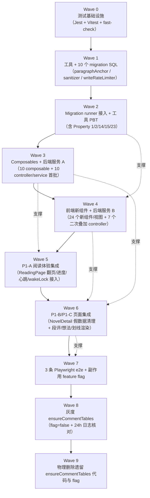

# Implementation Plan: 微信读书 / 晋江对标升级

> 文档日期：2026-05-17
> Spec 名称：wechat-jjwxc-parity-upgrade
> 类型：Feature 实施任务清单
> 关联文档：`./requirements.md`、`./design.md`

## Overview

本任务清单把 `requirements.md` 中 9 个模块、37 条 Requirement、23 条 Correctness Property 拆分为可在 4 周窗口内并行 / 顺序执行的编码任务，严格遵循 `design.md` 中的"实施顺序与里程碑"建议：

- **第 1 周（地基）**：Migration runner、段落锚点工具、输入清洗 / 频次限制中间件、10 个 migration SQL、前后端测试基础设施。
- **第 2 周（P0 急救）**：阅读设置统一、章节抽屉接入、书签接通、加书架 / 点赞、续读章节名、详情页假数据清理、首页"继续阅读"卡、个人中心统计。
- **第 3 周（P1-A 阅读体验补全）**：翻页方式、段落级阅读进度、心跳上报、屏幕常亮、TTS 听书、划线创建与渲染。
- **第 4 周（P1-B / P1-C 差异化收官）**：想法、段评、关注作者、书架红点、作者其他作品 / 同标签、勋章墙、首页分榜、搜索筛选、typeahead、推荐升级、Onboarding、书架增强、3 条 Playwright e2e、移除 `ensureCommentTables` 副作用。

### 任务粒度与编号约定

- 任务编号采用两级（`1` / `1.1`）；顶层任务为里程碑或大模块，子任务为可在 0.5–2 天完成的具体编码动作。
- 每个子任务均标注 `_Requirements: X.Y_`（粒度到子条款）以及（PBT 类）`_Properties: N_`。
- 子任务后缀 `*` 代表"测试类可选"任务，按工作流约束**不被默认实现**；核心实现任务不带 `*`。
- 检查点（Checkpoint）任务放在每周末，统一执行 `npm run test`、补必要 fix。

### 关键工程约束

1. 单文件代码 ≤ 1000 行，> 500 行考虑拆分；超大组件（`ReadingPage.vue`、`NovelDetailPage.vue`）必须**先抽 composable**再加新功能。
2. 后端测试栈：Jest + `fast-check` + `supertest`；前端测试栈：Vitest + `@vue/test-utils` + `fast-check`；e2e：Playwright。
3. 所有新增数据库变更通过 `backend/database/migrations/YYYYMMDDHHmm__description.sql` 落地，禁止运行时 `CREATE TABLE IF NOT EXISTS` 副作用。
4. 安全护栏：所有写接口经过 `sanitizeText` + `writeRateLimiter` 中间件，整数参数校验返回 `code: 'INVALID_PARAM'`。
5. 前后端的 `paragraphAnchor.computeHash` 实现必须**位逐位一致**（SHA-1 前 16 hex），由 Property 1 测试守住。

---

## Tasks

### 第 1 周：地基（基础设施 + Migration + 工具 + 测试栈）

- [x] 1. 后端测试基础设施与公共测试 helper
  - [x] 1.1 安装 fast-check / supertest 依赖并接入 Jest
    - 在 `backend/package.json` 中新增 `fast-check@^4`、`supertest@^7`，更新 `package-lock.json`
    - 在 `backend/jest.config.js` 中加入 `testMatch: ['**/tests/**/*.test.js']`
    - 在仓库根 `.gitignore` 中追加 `backend/coverage/`
    - _Requirements: 33.1, 33.2, 37.2_

  - [x] 1.2 搭建 backend/tests 目录骨架与共享测试工具
    - 新建 `backend/tests/setup.js`（统一连接 MySQL test schema 的 helper）、`backend/tests/utils/withTransactionalTestDb.js`（事务回滚保证用例隔离）、`backend/tests/utils/fcArbitraries.js`（导出 `paragraphTextArb`、`anchorTripleArb`、`heartbeatTimelineArb` 等可复用 fast-check arbitrary）
    - _Requirements: 37.2_

- [x] 2. Migration 框架与元数据表
  - [x] 2.1 实现 `backend/database/migrate.js`（runPendingMigrations + 元数据表）
    - 创建 `migrations(version PRIMARY KEY, description, applied_at)` 元数据表（首次运行自动建表）
    - 扫描 `backend/database/migrations/*.sql`，按文件名升序对比 `migrations.version` 集合，未执行项在事务中执行后写入元数据表
    - 任一 SQL 失败时回滚该 migration 并 `throw MigrationError`
    - 返回 `{ applied: [...], skipped: [...], latestVersion }`
    - _Requirements: 30.1, 30.2, 30.4, 30.5, 30.6_

  - [x] 2.2 在 `backend/src/app.js` 启动期接入 runPendingMigrations
    - 在 `app.listen` 之前 `await runPendingMigrations(db)`，失败时 `process.exit(1)` 拒绝启动 HTTP
    - 把"最近一次 migration version"挂到 `app.locals.migrationsState` 供 `/api/health` 读取
    - _Requirements: 30.4, 37.3_

  - [x]* 2.3 PBT：migration 幂等与有序 [Property 23]
    - **Property 23: Migration 幂等与有序**
    - **Validates: Requirements 30.2, 30.4, 30.6, 37.3**
    - 文件：`backend/tests/database/migrations.pbt.test.js`；fast-check 生成"任意顺序的多次启动"事件流，断言 `applied = files`、二次运行 `applied = []`、失败 migration 不入表

- [x] 3. 段落锚点工具（前后端共享算法）
  - [x] 3.1 实现 `backend/src/utils/paragraphAnchor.js`
    - 导出 `computeHash(text)`：`crypto.createHash('sha1').update(text.slice(0,50)).digest('hex').slice(0,16)`
    - 导出 `resolveParagraphAnchor(chapterId, paragraphIndex, paragraphHash, dbOrChapter)`：返回 `{ paragraphIndex, status: 'exact' | 'rehashed' | 'fallback' }`
    - 导出 `splitParagraphs(content)`：按 `\n\n+` 切段并去除首尾空白
    - _Requirements: 29.1, 29.4, 29.5, 29.6_

  - [x]* 3.2 PBT：paragraph hash 单射性与确定性 [Property 1]
    - **Property 1: Paragraph hash 单射且与字符串确定性绑定**
    - **Validates: Requirements 29.1, 29.7**
    - 文件：`backend/tests/utils/paragraphAnchor.pbt.test.js`

  - [x]* 3.3 PBT：resolveParagraphAnchor 三档语义 [Property 2]
    - **Property 2: 段落锚点解析三档语义（exact / rehashed / fallback）**
    - **Validates: Requirements 29.5, 29.6, 4.5**
    - 文件：`backend/tests/utils/paragraphAnchor.pbt.test.js`（与 3.2 同文件不同 describe block）

- [x] 4. 输入清洗与频次限制中间件
  - [x] 4.1 实现 `backend/src/utils/sanitizer.js`
    - 导出 `sanitizeText(input, { maxLen = 500 })`、`sanitizeComment(input)`：剥离 `<script>`、`javascript:` 协议、所有 `on*=` 属性（大小写不敏感），保留 zero-width / 中文字符
    - 超长抛 `{ code: 'COMMENT_TOO_LONG' }`
    - _Requirements: 34.1, 34.5_

  - [x] 4.2 实现 `backend/src/middlewares/writeRateLimiter.js`
    - 滑窗：同 `(userId, route)` 60 秒 ≤ 30 次；同 `(userId, route, normalizedContent)` 60 秒 ≤ 3 次
    - 优先使用 Redis（已存在依赖），降级到 in-memory LRU
    - 超限返回 HTTP 429 + `code: 'RATE_LIMITED'`
    - _Requirements: 34.2_

  - [x]* 4.3 PBT：写入路径安全护栏 [Property 14]
    - **Property 14: 写入路径安全护栏（XSS 清洗 + 频次限制 + 整数校验）**
    - **Validates: Requirements 34.1, 34.2, 34.3**
    - 文件：`backend/tests/middlewares/writeGuards.pbt.test.js`

- [x] 5. 落地 10 个 migration SQL 文件
  - [x] 5.1 编写 `202605170900__add_paragraph_columns.sql`
    - `ALTER TABLE reading_progress ADD COLUMN paragraph_index INT NULL`、`char_offset INT NULL`、`paragraph_hash CHAR(16) NULL`
    - _Requirements: 29.2, 30.1, 31.5_

  - [x] 5.2 编写 `202605170901__create_user_bookmarks.sql`
    - 新建 `user_bookmarks` 表（design.md §Data Models 第 5 节）
    - _Requirements: 1, 30.1_

  - [x] 5.3 编写 `202605170902__create_highlights.sql`
    - 新建 `highlights` 表（含 `note`、`color ENUM('yellow','green','red')`、`is_public`、`likes`、`reply_count`、`deleted_at`）
    - _Requirements: 25, 26, 30.1_

  - [x] 5.4 编写 `202605170903__create_paragraph_comments.sql`
    - 新建 `paragraph_comments` 表（含 `parent_id`、`deleted_at`、`(novel_id, chapter_id, paragraph_index)` 索引）
    - _Requirements: 27.1, 30.1_

  - [x] 5.5 编写 `202605170904__enable_user_follow_authors.sql`
    - 创建 `user_follow_authors`（含 `UNIQUE(user_id, author_id)`），与既有迁移文件对齐
    - _Requirements: 23.1, 30.1_

  - [x] 5.6 编写 `202605170905__create_user_interest_tags.sql`
    - 新建 `user_interest_tags(user_id, tag, weight DECIMAL(3,2) DEFAULT 1.00)`
    - _Requirements: 19.4, 20.4, 30.1_

  - [x] 5.7 编写 `202605170906__bookshelf_extensions.sql`
    - `ALTER TABLE bookshelf` 增加 `last_seen_chapter_id`、`group_name`、`is_top`，并把 `type` 枚举追加 `wishlist`
    - _Requirements: 21.1, 22.1, 24.1, 30.1_

  - [x] 5.8 编写 `202605170907__chapter_paragraph_hashes.sql`
    - `ALTER TABLE chapters ADD COLUMN paragraph_hashes JSON NULL`
    - _Requirements: 29.3, 30.1_

  - [x] 5.9 编写 `202605170908__user_achievements.sql`
    - 新建 `user_achievements(user_id, code, current_value, unlocked_at)`，`UNIQUE(user_id, code)`
    - _Requirements: 15, 30.1_

  - [x] 5.10 编写 `202605170909__migrate_comment_tables.sql`
    - 把 `commentController.ensureCommentTables` 内嵌的 `CREATE TABLE comments / comment_likes` 与 `init_step1.sql` schema 对齐成正式 migration（已存在表使用 `ALTER` 兼容差异）
    - _Requirements: 30.3_

- [x] 6. 章节正文 paragraph_hashes 同步
  - [x] 6.1 在章节写入 / 修订路径上同步刷新 `chapters.paragraph_hashes`
    - 在 `backend/src/services/chapterService.js`（如不存在则新建）的 `upsertChapter` 中，使用同一事务调用 `splitParagraphs(content).map(computeHash)` 写入 `paragraph_hashes` JSON
    - 提供 `recomputeAllParagraphHashes()` 一次性回填脚本（`backend/scripts/backfill-paragraph-hashes.js`）
    - _Requirements: 29.3_

  - [x]* 6.2 PBT：paragraph_hashes 与章节正文一致性 [Property 3]
    - **Property 3: chapters.paragraph_hashes 与正文一致**
    - **Validates: Requirements 29.3**
    - 文件：`backend/tests/services/chapterParagraphHashes.pbt.test.js`

- [x] 7. 前端测试基础设施（Vitest + fast-check）
  - [x] 7.1 安装 vitest / @vue/test-utils / fast-check 并配置 `vitest.config.js`
    - 在 `ai-xsread-vue3/package.json` 中新增 `vitest@^4`、`@vue/test-utils@^2.4`、`fast-check@^4`、`jsdom`
    - 创建 `ai-xsread-vue3/vitest.config.js`（环境 `jsdom`、`globals: true`）
    - 在 `ai-xsread-vue3/package.json` 中新增 `"test": "vitest --run"`、`"test:watch": "vitest"`
    - 不修改既有 `vite.config.js`，避免与 Vite 7 build 冲突
    - _Requirements: 37.2_

  - [x] 7.2 共享 frontend 测试 helper 与 fast-check arbitraries
    - 新建 `ai-xsread-vue3/src/test/setup.js`（注入 `localStorage` mock、`navigator.wakeLock` mock、`speechSynthesis` mock）
    - 新建 `ai-xsread-vue3/src/test/arbitraries.js`（`paragraphTextArb`、`anchorTripleArb`、`gestureArb`、`settingsArb` 等可复用 arbitrary）
    - _Requirements: 37.2_

- [x] 8. 共享拦截器 / 健康检查 / 401 同源 returnUrl
  - [x] 8.1 后端 401 统一响应中间件（含 `optionalAuth`）
    - 在 `backend/src/middlewares/auth.js` 增加 `optionalAuth`（无 token 不报错，挂 `req.user = null`），统一所有需登录接口的 401 返回 `{ code: 401, message: '请先登录' }`
    - _Requirements: 32.4_

  - [x] 8.2 前端 useReturnUrl composable + 全局 401 拦截器
    - 新建 `ai-xsread-vue3/src/composables/useReturnUrl.js`：导出 `buildLoginUrl(currentPath)`、`safeReturnUrl(raw)`（仅同源相对路径，否则回退 `/`）
    - 在 `ai-xsread-vue3/src/api/request.js` 增加 401 响应拦截 → 跳转 `/login?returnUrl=`
    - _Requirements: 32.1, 32.2, 32.3, 32.4, 32.5_

  - [x] 8.3 健康检查接口扩展（暴露 migration 版本号）
    - 在 `backend/src/routes/health.js`（新建）实现 `GET /api/health` 返回 `{ status, db, migrations: { latestVersion, total, lastAppliedAt } }`
    - _Requirements: 37.3_

  - [x]* 8.4 PBT：401 与 returnUrl 同源约束 [Property 15]
    - **Property 15: 401 与 returnUrl 同源约束**
    - **Validates: Requirements 32.2, 32.3, 32.4, 1.5, 9.7, 23.6, 25.6, 27.9**
    - 文件：`ai-xsread-vue3/src/composables/__tests__/useReturnUrl.pbt.test.js`

- [x] 9. 第 1 周地基检查点
  - 在本地运行 `cd backend && npm run test` 与 `cd ai-xsread-vue3 && npm run test`，确认所有第 1 周新增测试通过
  - 启动后端 `npm run dev` 验证 `migrate.js` 在空白 schema 与已迁移 schema 下均能正确收敛
  - 调用 `GET /api/health` 验证响应中 `migrations.latestVersion = '202605170909'`
  - Ensure all tests pass, ask the user if questions arise.
  - _Requirements: 30.6, 37.3_


### 第 2 周：P0 急救（让看上去能点的按钮真的能用）

- [x] 10. 阅读设置统一与 ReadingPage 拆分（先抽 composable 再加新功能）
  - [x] 10.1 把 ReadingPage.vue 的阅读偏好剥离到 useReadingSettings composable
    - 新建 `ai-xsread-vue3/src/composables/useReadingSettings.js`：作为唯一阅读偏好来源，导出 `settings`（reactive）、`save()`、`reset()`、`load()`，存储 key 为 `reading-settings`
    - 删除 `ReadingPage.vue` 内的 `xs-reading-prefs-v2` 临时持久化逻辑
    - 把"占位但不工作"的开关从 `SettingPanel.vue` 中移除（含双套字体 / 重复字号档位）
    - _Requirements: 7.1, 7.5_

  - [x] 10.2 SettingPanel.vue 重写为基于 useReadingSettings
    - 控件覆盖：字号 12–28 步长 1、行距 5 档、段距 3 档、页边距 3 档、字体 5 档、亮度 50–100 步长 5
    - "恢复默认"按钮在 ≤ 200ms 内重置全部偏好并立即生效
    - _Requirements: 7.2, 7.4_

  - [x] 10.3 创建 stores/readingSettingsStore.js（仅暴露给非 setup 上下文）
    - 复用 `useReadingSettings` 的 reactive state；该 store 不直接写 localStorage，避免双源
    - _Requirements: 7.1_

  - [x]* 10.4 PBT：阅读偏好 round-trip [Property 9]
    - **Property 9: useReadingSettings 偏好 round-trip**
    - **Validates: Requirements 7.2, 7.3, 3.6**
    - 文件：`ai-xsread-vue3/src/composables/__tests__/useReadingSettings.pbt.test.js`

- [x] 11. 章节抽屉接入与按需分页
  - [x] 11.1 后端 GET /api/novels/:novelId/chapters 支持分页与关键词
    - 在 `backend/src/controllers/chapterController.js` 中实现 `list({ novelId, page = 1, pageSize = 50, keyword })`，未提供 keyword 时按章节序号升序，提供 keyword 时按标题前缀匹配
    - 路由文件 `backend/src/routes/chapters.js` 注册该端点
    - _Requirements: 2.2, 2.4_

  - [x] 11.2 前端 ChapterDrawer.vue 增强（按需分页 + 章节搜索）
    - 在 `ai-xsread-vue3/src/components/reading/ChapterDrawer.vue` 中接入 `IntersectionObserver` 监听底部 200px 触底自动 fetch 下一页（page=50）
    - 顶部新增搜索 input：本地命中已加载范围，否则降级为后端搜索
    - _Requirements: 2.1, 2.2, 2.3, 2.4, 2.6_

  - [x] 11.3 ReadingPage 工具栏"目录"按钮接通 ChapterDrawer
    - 把原跳转回 NovelDetailPage 的逻辑改为打开 ChapterDrawer
    - 章节切换时仅更新路由 `?chapter=` 而不刷新整页（使用 router.replace + watch）
    - _Requirements: 2.1, 2.5_

  - [x]* 11.4 单元测试：ChapterDrawer 分页与搜索
    - 文件：`ai-xsread-vue3/src/components/reading/__tests__/ChapterDrawer.test.js`；覆盖 ≥ 50 / 100 / 1000 章规模下的滚动加载与本地 / 后端搜索切换
    - _Requirements: 2.2, 2.3, 2.4, 2.6_

- [x] 12. 书签创建 / 查看 / 删除
  - [x] 12.1 后端书签接口三件套
    - 实现 `backend/src/controllers/bookmarkController.js`（`create / listMine / listByNovel / remove`）
    - service `backend/src/services/bookmarkService.js` 调用 `resolveParagraphAnchor` 兜底锚点漂移
    - 路由 `backend/src/routes/bookmarks.js` 注册 `/api/user/bookmarks` 三端点
    - 写接口接入 `writeRateLimiter` + `sanitizeText({ maxLen: 500 })`（针对 `note`）
    - _Requirements: 1.1, 1.4, 34.1, 34.2_

  - [x] 12.2 前端 BookmarkSheet.vue + 工具栏接通
    - 新建 `ai-xsread-vue3/src/components/reading/BookmarkSheet.vue`，长按工具栏书签 ≥ 500ms 弹出，按 created_at DESC 显示
    - 短按：以当前屏幕中心可视段落 anchor 创建书签 + toast "已加书签"
    - 长按：列出全部书签，支持删除 / 跳转
    - 工具栏图标根据 `isBookmarked(currentAnchor)` 切换激活态
    - _Requirements: 1.1, 1.2, 1.3, 1.4, 1.6_

  - [x] 12.3 未登录引导（书签按钮触发登录跳转）
    - 在 `ReadingPage.vue` 点击书签按钮前调用 `useReturnUrl.buildLoginUrl(currentPath)` 跳转
    - _Requirements: 1.5, 32.2_

  - [x] 12.4 新增 views/MyBookmarksPage.vue（个人中心入口）
    - 新建路由 `/profile/bookmarks`；调用 `GET /api/user/bookmarks?page=&pageSize=` 分页展示
    - _Requirements: 1.2_

  - [x]* 12.5 PBT：书签 round-trip [Property 10 子集]
    - **Property 10: 用户内容写入 round-trip（书签 add / remove / 幂等）**
    - **Validates: Requirements 1.1, 1.4**
    - 文件：`backend/tests/services/bookmark.pbt.test.js`

- [x] 13. 详情页"加书架 / 点赞"按钮接通
  - [x] 13.1 后端 GET /api/novels/:id/status + POST/DELETE 加书架与点赞
    - 在 `backend/src/controllers/novelController.js` 中新增 `likeAndShelfStatus`、`like`、`unlike`
    - 在 `backend/src/controllers/userController.js` 完善 `addBookshelf / removeBookshelf`（支持 `type=reading|wishlist`）
    - 写接口注入 `writeRateLimiter`
    - _Requirements: 9.1, 9.2, 9.3, 9.4, 9.5, 9.8_

  - [x] 13.2 前端 NovelDetailPage 底部 CTA 接通
    - 在 `ai-xsread-vue3/src/views/NovelDetailPage.vue` 的 `onMounted` 调用 `GET /api/novels/:id/status` 初始化按钮态
    - 加书架 / 点赞按钮在请求 in-flight 期间显示 loading + 禁用重复点击
    - 失败时恢复按钮态 + toast "操作失败，请稍后再试"
    - _Requirements: 9.1, 9.2, 9.3, 9.4, 9.5, 9.6, 9.8_

  - [x] 13.3 未登录跳转登录页
    - 把"加书架 / 点赞"按钮的点击 handler 包装为 `requireLogin` HOF，调用 `useReturnUrl`
    - _Requirements: 9.7, 32.2_

  - [x]* 13.4 集成测试：加书架 / 点赞 happy + 401 / 429 / 400
    - 文件：`backend/tests/routes/novelStatus.test.js`（supertest）
    - _Requirements: 9.1–9.8_

- [x] 14. 续读章节名（详情页 + 首页）
  - [x] 14.1 后端 GET /api/user/reading-progress/:novelId 返回章节标题
    - 在 service 中 join `chapters` 取出 `chapter_title`，挂到响应 `data.chapterTitle`
    - 同时返回 `progress`、新字段 `paragraph_index/char_offset/paragraph_hash`（即便未来才使用，本次先返回 NULL）
    - _Requirements: 10.1, 10.2, 31.1_

  - [x] 14.2 NovelDetailPage 底部 CTA 文案"续读 · {chapter_title}"
    - 进度存在时按钮文案"续读 · {chapter_title}"，否则"开始阅读"
    - 点击跳转 `/reading/:novelId?chapter={chapter_id}`
    - _Requirements: 10.2, 10.3, 10.5_

  - [x] 14.3 HomePage "继续你的故事" 卡接真实数据
    - 已登录时调用 `GET /api/user/reading-history?page=1&pageSize=1`
    - 渲染：标题 + "上次读到 第 N 章 · {chapter_title}" + 已读 X% + 预计剩余阅读时长（350 字 / 分钟）
    - 空记录降级为"故事入境，杂念自消"欢迎区
    - _Requirements: 13.1, 13.2, 13.3, 13.4_

  - [x]* 14.4 单元测试：useReadingHistoryEntry 计算逻辑
    - 文件：`ai-xsread-vue3/src/composables/__tests__/useReadingHistoryEntry.test.js`
    - _Requirements: 13.2_

- [x] 15. 详情页假数据清理与空态
  - [x] 15.1 移除 NovelDetailPage 中的硬编码字段
    - 删除 `authorFans = '12.3k'`、`readers = '12.4 万'`、`distribution = [78, 15, 5, 1, 1]`、CTA "2.1k" 点赞数、"3,421 人评分"
    - _Requirements: 11.1_

  - [x] 15.2 后端 GET /api/novels/:id/rating 实现真实评分分布
    - 在 `novelController.ratingDistribution` 中聚合 `comments.rating`（或独立评分表）输出 `{ ratingCount, average, distribution: { 1..5: pct } }`
    - 当 `ratingCount === 0` 时返回零分布（前端按空态处理）
    - _Requirements: 11.2, 11.3_

  - [x] 15.3 NovelDetailPage 渲染评分模块（含空态）
    - 接收响应后渲染五星条；空态显示"本书暂无评分，成为第一个评分的人 →"+ 五颗灰星 + 五条 0% 占位
    - 对 `readers / authorFans / likeCount / commentCount` 字段：响应到达且非 null 才渲染（不显示骨架、不显示"--"）
    - _Requirements: 11.3, 11.4_

  - [x] 15.4 详情页评论模块接 GET /api/novels/:novelId/comments 并提供空态
    - 空列表时显示"暂无书评，写下第一条想法"+ "写书评" 按钮
    - _Requirements: 11.5_

  - [x]* 15.5 PBT：评分分布与字段空态 [Property 21]
    - **Property 21: 评分分布与字段空态**
    - **Validates: Requirements 11.2, 11.3, 11.4**
    - 文件：`backend/tests/services/ratingDistribution.pbt.test.js`

- [x] 16. 个人中心阅读统计接真实接口
  - [x] 16.1 后端 GET /api/user/statistics
    - 实现 `userStatsService.aggregateStats(userId)`：bookshelf 计数（按 type 分桶）、`readingStreak`、`readTime.total/today/week`、`readingTrend`（最近 7 天）、`joinDays`
    - _Requirements: 14.2, 14.6_

  - [x] 16.2 ProfilePage 移除硬编码并接 useUserStats composable
    - 新建 `ai-xsread-vue3/src/composables/useUserStats.js`
    - 删除 `shelf: 32 / streak: 14 / hours: 287 / joinDays: 287 / weekData` 占位
    - "X 分钟" / "X 小时" 格式化按 < 60 分钟 vs ≥ 60 分钟分支
    - _Requirements: 14.1, 14.2, 14.3, 14.6_

  - [x] 16.3 WeekBarChart 组件
    - 新建 `ai-xsread-vue3/src/components/profile/WeekBarChart.vue`：按周内最大值归一化高度，当天柱用主色高亮
    - 空态："本周还没有阅读记录，去打开一本书吧 →" 跳 HomePage
    - _Requirements: 14.4, 14.5_

  - [x]* 16.4 单元测试：useUserStats / WeekBarChart 归一化
    - 文件：`ai-xsread-vue3/src/composables/__tests__/useUserStats.test.js`
    - _Requirements: 14.4, 14.5_

- [x] 17. 第 2 周 P0 急救检查点
  - 后端 + 前端跑 `npm run test`，本地 `npm run dev` 手动验证：详情页加书架 / 点赞 / 续读 / 评分 / 评论空态、ChapterDrawer 翻页、书签创建 / 删除、首页"继续阅读"卡、个人中心统计正常
  - Ensure all tests pass, ask the user if questions arise.
  - _Requirements: 1, 2, 9, 10, 11, 13, 14_


### 第 3 周：P1-A 阅读体验补全 + 部分 P1-B（划线）

- [x] 18. 翻页方式（scroll / tap / swipe）
  - [x] 18.1 实现 PageFlipController 与 usePageFlip composable
    - 新建 `ai-xsread-vue3/src/composables/usePageFlip.js`：根据 `settings.pageFlipMode` 派发 `prev / next / toggle / ignore`
    - 新建 `ai-xsread-vue3/src/components/reading/PageFlipController.vue`：把屏幕分为左 / 中 / 右三区（tap 模式）；监听 swipe（≥ 50px ∧ ≤ 300ms ∧ dy === 0）；屏幕边缘 ≤ 12px swipe 一律 ignore
    - 翻页过渡 ≤ 200ms 渐隐；不改变浏览器原生 scrollTop
    - _Requirements: 3.1, 3.2, 3.3, 3.4, 3.5, 3.6, 3.7, 36.3_

  - [x] 18.2 在 ReadingPage 接入 usePageFlip 与 settings.pageFlipMode 选项
    - 阅读设置面板新增"翻页方式"下拉
    - _Requirements: 3.1, 3.6_

  - [x]* 18.3 PBT：翻页几何与手势映射 [Property 8]
    - **Property 8: 翻页几何与手势映射**
    - **Validates: Requirements 3.3, 3.4, 3.5, 3.7, 36.3**
    - 文件：`ai-xsread-vue3/src/composables/__tests__/usePageFlip.pbt.test.js`

- [x] 19. 段落级阅读位置同步
  - [x] 19.1 实现 useParagraphAnchor composable（前端 hash 与后端一致）
    - 新建 `ai-xsread-vue3/src/composables/useParagraphAnchor.js`：内部封装 IntersectionObserver，导出 `track(el)`、`currentAnchor`、`restore(anchor)`、`computeHash(text)`（与后端实现位逐位一致）
    - 段落停留 ≥ 1s 视为生效锚点
    - _Requirements: 4.1, 4.4, 29.1, 29.7_

  - [x] 19.2 后端 readingProgressService 升级（接收新字段 + resolveParagraphAnchor）
    - 在 `backend/src/services/readingProgressService.js` 接受 `(novelId, chapterId, paragraphIndex, charOffset, paragraphHash, progress, duration)`，仅 `novelId` 必填
    - 写入前调用 `resolveParagraphAnchor`，把 `status` 写入响应 `progressApplied`
    - INSERT ... ON DUPLICATE KEY UPDATE，缺失字段不更新对应列
    - _Requirements: 4.3, 31.2_

  - [x] 19.3 ReadingPage 进度恢复路径（章节加载完后定位段落）
    - 加载章节后 `await restore(serverAnchor)`：scrollIntoView 段落到屏幕中央
    - 服务器锚点越界或 hash 不匹配时按 `resolveParagraphAnchor` 三档语义降级，仍未命中则回到章节首
    - _Requirements: 4.4, 4.5_

  - [x] 19.4 本地与服务器进度合并（max-by-updatedAt）
    - 同时存在 localStorage 与服务器进度时取 `argmax(updatedAt)`，并把另一侧覆盖更新
    - onUnmounted 一次 flush，且使用 `navigator.sendBeacon` 兜底
    - _Requirements: 4.6, 4.7_

  - [x]* 19.5 PBT：进度合并 max-by-updatedAt [Property 7]
    - **Property 7: 进度合并 max-by-updatedAt**
    - **Validates: Requirements 4.6**
    - 文件：`ai-xsread-vue3/src/composables/__tests__/mergeProgress.pbt.test.js`

  - [x]* 19.6 PBT：进度同步节流 [Property 6]
    - **Property 6: 进度同步节流（≤ 1 次 / 5s + onUnmounted flush）**
    - **Validates: Requirements 4.2, 4.7**
    - 文件：`ai-xsread-vue3/src/composables/__tests__/throttleDebounce.pbt.test.js`

- [x] 20. 阅读时长心跳上报
  - [x] 20.1 实现 useReadingHeartbeat composable
    - 新建 `ai-xsread-vue3/src/composables/useReadingHeartbeat.js`：维护 `visibilitychange / focus / blur / scroll|touch|click / onUnmounted` 五类事件合流，60s tick → POST progress with duration:60；连续 ≥ 60s 无输入 → 暂停；视口恢复 ≤ 5s 重启
    - onUnmounted 一次性 flush 不足 60s 的尾部 duration
    - 心跳连续失败 5 次后停止心跳直到下一次 visibility=visible
    - _Requirements: 5.1, 5.2, 5.3, 5.6_

  - [x] 20.2 后端 reading_history.duration 累加 + 单次 clamp 60 + 单条 86400
    - 在 service 中：`applied = LEAST(max(0, duration), 60)`；超过 120 输出 WARN 日志
    - `UPDATE reading_history SET duration = LEAST(duration + applied, 86400)`
    - _Requirements: 5.4, 5.5_

  - [x] 20.3 ReadingPage 接入 useReadingHeartbeat
    - onMounted 启动；onUnmounted flush 后 stop
    - _Requirements: 5.1, 5.6_

  - [x]* 20.4 PBT：心跳生命周期 [Property 4]
    - **Property 4: 阅读进度心跳生命周期**
    - **Validates: Requirements 5.1, 5.2, 5.3, 5.6**
    - 文件：`ai-xsread-vue3/src/composables/__tests__/useReadingHeartbeat.pbt.test.js`

  - [x]* 20.5 PBT：reading_history.duration 累加与 clamp [Property 5]
    - **Property 5: duration 累加与 clamp 上限**
    - **Validates: Requirements 5.4, 5.5**
    - 文件：`backend/tests/services/readingProgress.pbt.test.js`

  - [x]* 20.6 PBT：向后兼容字段不变量 [Property 22]
    - **Property 22: 向后兼容字段不变量**
    - **Validates: Requirements 31.1, 31.2, 31.3, 31.7**
    - 文件：`backend/tests/services/backwardCompat.pbt.test.js`

- [x] 21. 屏幕常亮与沉浸阅读
  - [x] 21.1 实现 useWakeLock composable
    - 新建 `ai-xsread-vue3/src/composables/useWakeLock.js`：导出 `request()`、`release()`，监听 `visibilitychange` 自动续期
    - 浏览器不支持时禁用开关 + 显示提示文案
    - _Requirements: 6.2, 6.3, 6.4, 6.5_

  - [x] 21.2 阅读设置面板新增"屏幕常亮"开关
    - 默认关闭；开启时进入 ReadingPage 后调用 `request('screen')`
    - 离开 ReadingPage（路由切换 / Tab 隐藏）调用 `release()`
    - _Requirements: 6.1, 6.2, 6.3_

  - [x]* 21.3 单元测试：useWakeLock 状态机 + 不支持降级
    - 文件：`ai-xsread-vue3/src/composables/__tests__/useWakeLock.test.js`
    - _Requirements: 6.4, 6.5_

- [x] 22. TTS 朗读（听书）
  - [x] 22.1 实现 useTTS composable
    - 新建 `ai-xsread-vue3/src/composables/useTTS.js`：基于 `window.speechSynthesis`，导出 `play / pause / next / prev / stop`、当前段落 ref
    - 朗读时把当前段落滚动到屏幕中央并以浅黄背景临时高亮（结束 ≤ 300ms 淡出）
    - `getVoices()` 为空时立即结束本次启动（兼容降级）
    - 路由离开 → `speechSynthesis.cancel()`
    - 自动加载下一章逻辑符合 Requirement 8.5 的分支语义
    - _Requirements: 8.1, 8.4, 8.5, 8.6, 8.7_

  - [x] 22.2 TTSControlBar.vue 控制条组件
    - 新建 `ai-xsread-vue3/src/components/reading/TTSControlBar.vue`：暂停 / 继续 / 上一段 / 下一段 / 关闭、当前朗读段（≤ 60 字省略）、速度（0.5–2.0）、音色下拉（仅暴露实际可用列表）
    - _Requirements: 8.2, 8.3_

  - [x] 22.3 ReadingPage 工具栏接入 TTSControlBar
    - 工具栏新增"听书"按钮 → 启动 useTTS + 显示控制条
    - _Requirements: 8.1, 8.7_

  - [x]* 22.4 单元测试：useTTS 关键分支（不支持 / 读完最后一段 / 路由离开）
    - 文件：`ai-xsread-vue3/src/composables/__tests__/useTTS.test.js`
    - _Requirements: 8.5, 8.6, 8.7_

- [x] 23. 划线（Highlight）创建与渲染
  - [x] 23.1 后端 highlight 路由与 service
    - 实现 `backend/src/controllers/highlightController.js`（`create / update / remove / listByChapter / listMine / listMyNotes / listHotForNovel`）
    - 路由 `backend/src/routes/highlights.js` 与 `userController` 中 `/api/user/highlights`、`/api/user/notes`
    - 写接口接入 `writeRateLimiter` + `sanitizeText`；`note` ≤ 500 字超长返回 `COMMENT_TOO_LONG`
    - service 软删除 `deleted_at`
    - _Requirements: 25.2, 25.4, 26.2, 34.1, 34.2, 34.5_

  - [x] 23.2 实现 useHighlightToolbar composable
    - 新建 `ai-xsread-vue3/src/composables/useHighlightToolbar.js`：监听 `selectionchange`，计算工具菜单坐标，移动端 360px 单行水平按钮组（颜色 + 复制 + 想法 + 段评，间距 ≥ 4px、可点击区 ≥ 32×32）
    - 选区取消 / 点击页面其他位置自动关闭
    - _Requirements: 25.1, 25.7, 25.8_

  - [x] 23.3 HighlightToolbar.vue 工具菜单组件
    - 新建 `ai-xsread-vue3/src/components/reading/HighlightToolbar.vue`：黄 / 绿 / 红、复制、写想法、段评 6 个按钮
    - 点击颜色 → 调 `POST /api/highlights` + 200ms 内本地把选区包成 `<mark>`
    - 长按已划线段落上的高亮文字 → 弹改色 / 删除 / 写想法
    - _Requirements: 25.1, 25.2, 25.4_

  - [x] 23.4 ReadingPage 章节渲染恢复划线
    - 进入章节后调用 `GET /api/highlights?novelId=&chapterId=` 通过 `(paragraphIndex, paragraphHash, startOffset, endOffset)` 重建 `<mark>`；fallback 状态以更浅颜色 + tooltip 提示
    - 提取 `composables/useHighlightRenderer.js` 与 `stores/highlightsStore.js` 缓存
    - _Requirements: 25.3_

  - [x] 23.5 新增 views/MyHighlightsPage.vue（个人中心入口）
    - 调用 `GET /api/user/highlights` 时间倒序展示
    - _Requirements: 25.5_

  - [x] 23.6 未登录引导（划线工具菜单颜色按钮触发登录跳转）
    - _Requirements: 25.6, 32.2_

  - [x]* 23.7 PBT：划线章节渲染等价性 [Property 20]
    - **Property 20: 划线章节渲染等价性**
    - **Validates: Requirements 25.2, 25.3, 25.4, 25.5**
    - 文件：`ai-xsread-vue3/src/composables/__tests__/highlightRenderer.pbt.test.js`

  - [x]* 23.8 PBT：划线 round-trip [Property 10 子集]
    - **Property 10: 用户内容写入 round-trip（划线 add / remove / 改色 / 幂等）**
    - **Validates: Requirements 25.2, 25.4**
    - 文件：`backend/tests/services/highlight.pbt.test.js`

- [x] 24. 第 3 周阅读体验检查点
  - 前后端跑 `npm run test`；手动验证：翻页方式三态、段落级进度跨设备同步、心跳 60s 累加、屏幕常亮在支持的浏览器上生效、TTS 控制条交互、划线创建 → 退出 → 重进可见
  - Ensure all tests pass, ask the user if questions arise.
  - _Requirements: 3, 4, 5, 6, 8, 25_


### 第 4 周：差异化收官（P1-B 收尾 + P1-C + e2e + 移除副作用）

- [x] 25. 想法（Note）
  - [x] 25.1 NoteSheet.vue 想法 bottomsheet 组件
    - 新建 `ai-xsread-vue3/src/components/reading/NoteSheet.vue`：原文预览、≥ 4 行多行输入、保存 / 取消、实时 "已输入 N / 500"
    - 点击保存 → `POST /api/highlights`（首次划线带 note）或 `PATCH /api/highlights/:id`（已存在划线追加 note）
    - _Requirements: 26.1, 26.2, 26.3_

  - [x] 25.2 后端 GET /api/user/notes + GET /api/novels/:novelId/notes/hot
    - 在 `highlightController.listMyNotes` 中查询 `note IS NOT NULL AND deleted_at IS NULL` 时间倒序
    - `listHotForNovel` 中按 `interactionScore = likes + reply_count*2 + min(content_length/50, 5)` 降序，限制 5 条
    - 原文片段对应章节被删除时不提供跳转链接，前端显示"原文已被作者删除"
    - _Requirements: 26.4, 26.5, 26.6_

  - [x] 25.3 新增 views/MyNotesPage.vue（个人中心入口）
    - _Requirements: 26.4_

  - [x] 25.4 NovelDetailPage "读者想法" 区块（HotNotesSection.vue）
    - 新建 `ai-xsread-vue3/src/components/novel/HotNotesSection.vue`：调用 `GET /api/novels/:novelId/notes/hot?limit=5` 渲染热门想法
    - _Requirements: 26.5_

  - [x]* 25.5 PBT：互动质量分计算 [Property 12]
    - **Property 12: Interaction score 计算（单调性 / 上界 / 非负性）**
    - **Validates: Requirements 35.1**
    - 文件：`backend/tests/services/interactionScore.pbt.test.js`

  - [x]* 25.6 PBT：内容长度上限 [Property 13]
    - **Property 13: 内容长度 ≤ 500 字护栏**
    - **Validates: Requirements 26.3, 27.8, 34.5**
    - 文件：`backend/tests/services/contentLength.pbt.test.js`

- [x] 26. 段评（Paragraph_Comment）
  - [x] 26.1 后端 paragraphCommentController + service
    - 实现 `aggregateCounts / listByParagraph / create / softDelete / like / unlike`
    - service 强制 `parent_id !== null` 时 `parent.parent_id IS NULL`，否则 400 `PARAGRAPH_COMMENT_DEPTH_EXCEEDED`
    - 写接口接入 `writeRateLimiter`、`sanitizeText`；超 500 字 400 `COMMENT_TOO_LONG`
    - 维护冗余 `reply_count` 字段（事务内 +1 / -1）
    - _Requirements: 27.1, 27.4, 27.6, 27.7, 27.8_

  - [x] 26.2 ParagraphCommentBubble.vue 气泡组件
    - 新建 `ai-xsread-vue3/src/components/reading/ParagraphCommentBubble.vue`：每段右侧渲染气泡（N=0 不渲染），360px 下大小 ≥ 24×24、距右边距 ≥ 8px、`position: sticky` + `transform` 渲染避免 layout
    - _Requirements: 27.2, 27.11_

  - [x] 26.3 ParagraphCommentSheet.vue 段评抽屉组件
    - 新建 `ai-xsread-vue3/src/components/reading/ParagraphCommentSheet.vue`：调 `GET /api/paragraph-comments?paragraphIndex=...` 分页拉取（按 interactionScore 降序）
    - 点赞 / 取消点赞 → `POST/DELETE /api/paragraph-comments/:id/like` 切换图标 + 数字 ±1
    - 楼中楼仅一层（前端禁止对 reply 再回复）
    - 软删除后从抽屉移除并气泡数 -1
    - _Requirements: 27.3, 27.4, 27.5, 27.6, 27.7, 27.8_

  - [x] 26.4 useParagraphCommentBubble composable + 5 分钟前端缓存
    - 新建 `ai-xsread-vue3/src/composables/useParagraphCommentBubble.js`：聚合数 5 分钟 TTL 缓存（`stores/paragraphCommentsStore.js`）
    - _Requirements: 27.10_

  - [x] 26.5 ReadingPage 接入气泡 + 抽屉 + 未登录引导
    - 章节加载后调用聚合接口；点击气泡打开抽屉；未登录点击发送 / 点赞 / 回复 → 跳登录
    - _Requirements: 27.2, 27.3, 27.9, 32.2_

  - [x]* 26.6 PBT：段评一层楼限制与气泡数一致性 [Property 19]
    - **Property 19: 段评一层楼限制与气泡数一致性**
    - **Validates: Requirements 27.4, 27.6, 27.7**
    - 文件：`backend/tests/services/paragraphComment.pbt.test.js`

  - [x]* 26.7 PBT：列表排序不变量 [Property 11]
    - **Property 11: 列表排序不变量（互动质量降序 / 时间降序 / 软删除不混入）**
    - **Validates: Requirements 1.2, 22.7, 26.5, 27.3, 28.3, 35.1, 15.3, 11.4**
    - 文件：`backend/tests/services/listSorting.pbt.test.js`

  - [x]* 26.8 PBT：时间窗内单飞 / 节流 / 缓存 [Property 16]
    - **Property 16: 时间窗内单飞 / 节流 / 缓存**
    - **Validates: Requirements 4.2, 18.2, 27.10, 33.5, 16.3**
    - 文件：`backend/tests/utils/memoryCache.pbt.test.js`、`ai-xsread-vue3/src/utils/__tests__/throttleDebounce.pbt.test.js`

- [x] 27. 关注作者真落库 + "我关注的作者"
  - [x] 27.1 后端 author 路由与 service
    - 实现 `backend/src/controllers/authorController.js`（`detail / novels / follow / unfollow / listFollowing`）
    - service 使用 `INSERT IGNORE` 保证幂等；`detail` 在 `optionalAuth` 下计算 `isFollowing`
    - _Requirements: 23.1, 23.2, 23.3, 23.4, 28.1_

  - [x] 27.2 前端 useFollowAuthor composable
    - 新建 `ai-xsread-vue3/src/composables/useFollowAuthor.js`：状态缓存 + 关注 / 取消关注 API
    - 未登录跳登录页（带 returnUrl）
    - _Requirements: 23.6, 32.2_

  - [x] 27.3 NovelDetailPage / AuthorPage 接入"关注作者"按钮
    - 在已有 `AuthorPage.vue` 上接入按钮态；NovelDetailPage 作者卡片同样接通
    - _Requirements: 23.2, 23.3, 23.4, 28.2_

  - [x] 27.4 ProfilePage "我关注的作者" 区块 + FollowingAuthorList
    - 新建 `ai-xsread-vue3/src/components/profile/FollowingAuthorList.vue`
    - 已关注 ≥ 1 时渲染区块且隐藏快捷功能区入口；否则显示快捷入口
    - _Requirements: 23.5, 28.4, 28.6_

  - [x] 27.5 新增 views/FollowingAuthorsPage.vue 全部关注列表
    - 调 `GET /api/user/following-authors` 分页；最近 7 天更新作品标"NEW"
    - _Requirements: 28.4, 28.5_

- [x] 28. 书架增强（wishlist + 分组 + 批量 + 排序 + 红点）
  - [x] 28.1 后端 bookshelf 接口扩展
    - 在 `userController.listBookshelf` 中支持 `sortBy / type=wishlist`；`type=wishlist` 不计入"在读 / 已读"统计
    - 新增 `userController.batchBookshelf`（`{ action: 'delete' | 'group' | 'top' | 'untop', ids: [...], groupName? }`）
    - "想读 → 开始阅读"自动把 type 切回 reading
    - _Requirements: 21.2, 21.4, 21.5, 22.4, 22.5, 22.6, 22.7_

  - [x] 28.2 前端 BookshelfPage 增加"想读"Tab + 排序下拉 + 分组下拉
    - 在 `ai-xsread-vue3/src/views/BookshelfPage.vue` 新增 Tab、`GroupSelector.vue`、`BookshelfTabBar.vue`
    - _Requirements: 21.2, 22.2, 22.7_

  - [x] 28.3 批量管理条 BatchActionBar.vue
    - 新建 `ai-xsread-vue3/src/components/bookshelf/BatchActionBar.vue`：选中态 / 移动到分组 / 删除 / 置顶 / 取消置顶
    - _Requirements: 22.3, 22.4, 22.5, 22.6_

  - [x] 28.4 实现 unreadUpdateService 与 hasUnreadUpdate 字段
    - 在 `backend/src/services/unreadUpdateService.js` 计算 `MAX(chapters.id)` vs `bookshelf.last_seen_chapter_id`
    - 在 `GET /api/user/bookshelf` 响应每本书附加 `hasUnreadUpdate`
    - 阅读时 `readingProgressService` 同步更新 `last_seen_chapter_id`
    - _Requirements: 24.1, 24.2, 24.3_

  - [x] 28.5 UnreadBadge.vue 红点组件 + BookshelfPage 接入
    - 新建 `ai-xsread-vue3/src/components/bookshelf/UnreadBadge.vue`：直径 8px 红色实心圆点；与"已读完"对勾互斥
    - "我关注的作者"卡片右上角同样显示红点
    - _Requirements: 24.4, 24.5, 24.6_

  - [x]* 28.6 PBT：红点不变量 [Property 18]
    - **Property 18: Unread update badge 不变量（单调性 / 阅读后消失 / 关注作者新作）**
    - **Validates: Requirements 24.2, 24.3, 24.4, 24.5, 24.6**
    - 文件：`backend/tests/services/unreadUpdate.pbt.test.js`

  - [x]* 28.7 PBT：内容写入 round-trip 综合（书架 / 关注 / 点赞）[Property 10 综合]
    - **Property 10: 用户内容写入 round-trip（书架 add/remove、关注 follow/unfollow、点赞 like/unlike）**
    - **Validates: Requirements 9.2, 9.3, 9.4, 9.5, 22.4, 22.5, 23.2, 23.3, 23.4, 27.4, 27.5, 27.6**
    - 文件：`backend/tests/services/userContent.pbt.test.js`

- [x] 29. 勋章墙
  - [x] 29.1 后端 achievementService + GET /api/user/achievements
    - 新建 `backend/src/services/achievementService.js`：内置 16 条规则 codeMap（不入库）；`evaluate(userId)` 计算 currentValue 与 unlockedAt；`UNIQUE(user_id, code)` 防重复解锁
    - controller `achievementController.list` 返回分组 + summary
    - _Requirements: 15.2_

  - [x] 29.2 新增 views/AchievementsPage.vue + AchievementCard.vue
    - 已解锁按 `unlockedAt DESC`，未解锁按完成度降序；进度条 `min(currentValue/threshold, 1) × 100%` + "X / Y"
    - _Requirements: 15.2, 15.3, 15.4_

  - [x] 29.3 useAchievements composable + 新解锁动效（仅离开 ReadingPage 后回放）
    - 新建 `ai-xsread-vue3/src/composables/useAchievements.js`：阅读期间不主动检测；新解锁动画 ≤ 1.5s 不阻塞交互；尊重 `prefers-reduced-motion`
    - _Requirements: 15.5, 15.6, 15.7, 35.3, 35.5_

  - [x] 29.4 ProfilePage "我的勋章" 入口
    - 入口对所有登录用户无条件可见
    - _Requirements: 15.1_

- [x] 30. 首页分榜（按分类切换 Top 10）
  - [x] 30.1 后端 GET /api/novels 支持 categoryId / status=finished / sortBy / order
    - 在 `novelController.list` 中接入查询参数；完结榜不附加 categoryId
    - _Requirements: 16.5, 17.2_

  - [x] 30.2 RankTabSection.vue 首页分榜区块
    - 新建 `ai-xsread-vue3/src/components/novel/RankTabSection.vue`：六个 Tab（古言 / 现言 / 纯爱 / 悬疑 / 治愈 / 完结），≤ 300ms 切换
    - 5 分钟前端缓存（`stores/recommendationStore.js`）
    - "完整榜单 →" 跳转 `/recommend?categoryId=&sortBy=views`
    - _Requirements: 16.1, 16.2, 16.3, 16.4, 16.6_

- [x] 31. 搜索筛选面板
  - [x] 31.1 后端 GET /api/novels(/search) 增加筛选参数
    - 新增 `wordCountMin / wordCountMax / ratingMin / hasFinished / sortBy(default|updated_at|word_count) / tags / exclude`
    - _Requirements: 17.2_

  - [x] 31.2 SearchFilterPanel.vue + SearchPage 接入 URL 同步
    - 新建 `ai-xsread-vue3/src/components/novel/SearchFilterPanel.vue`：状态 / 字数 / 评分 / 排序四组下拉 + "重置"按钮
    - URL `query` 参数与筛选项双向绑定，便于复制 / 回退
    - 空匹配时显示空态"没有符合条件的小说，试试放宽筛选 →"
    - _Requirements: 17.1, 17.3, 17.4, 17.5, 17.6_

- [x] 32. typeahead 实时搜索建议
  - [x] 32.1 后端 GET /api/novels/search/suggestions
    - 实现 `novelController.suggestions`，返回 ≤ 8 条按热度截断；服务端 60s 内存缓存（key=keyword）
    - _Requirements: 18.5, 33.5_

  - [x] 32.2 EnhancedSearchBar.vue + SearchPage 替换原 input
    - 新建 `ai-xsread-vue3/src/components/common/EnhancedSearchBar.vue`：debounce 200ms、关键词 `<mark>` 高亮、键盘 ↑↓ Enter Esc 导航；keyword 长度 < 1 或 in-flight 时不刷新建议；清空时立即关闭
    - _Requirements: 18.1, 18.2, 18.3, 18.4, 18.6, 18.7_

- [x] 33. 推荐算法升级 + 冷启动
  - [x] 33.1 后端 recommendationService.recommend(userId, options)
    - 在 `backend/src/services/recommendationService.js` 实现加权打分：tagSim 0.4 / durationFit 0.3 / cf 0.2 / freshness 0.1（warm）；冷启动模式（30 天 history < 3）：tagSim 0.6 / durationFit 0.3 / freshness 0.1 / cf 0；新注册仅按 `user_interest_tags` + 评分降序
    - 60s 内存缓存 key=`userId or 'guest'`；候选 < 10 时全站评分兜底
    - 任一分项失败降级为"全站评分 Top 20"
    - _Requirements: 19.1, 19.2, 19.5, 19.6, 19.7_

  - [x] 33.2 controller GET /api/novels/recommend 接入 service
    - 在 `novelController.recommend` 暴露 `strategy: 'cold'|'warm'|'guest'` 字段
    - _Requirements: 19.1_

  - [x]* 33.3 PBT：推荐打分与冷启动分支 [Property 17]
    - **Property 17: 推荐打分与冷启动分支**
    - **Validates: Requirements 19.1, 19.2, 19.6, 19.7**
    - 文件：`backend/tests/services/recommendation.pbt.test.js`

- [x] 34. Onboarding 兴趣标签选择
  - [x] 34.1 后端 POST/GET /api/user/interest-tags
    - 实现 `interestTagController`：`INSERT IGNORE`，已存在 tag `weight = LEAST(weight + 0.1, 5.0)`
    - _Requirements: 19.4, 20.4_

  - [x] 34.2 新增 views/OnboardingInterestsPage.vue
    - 展示 ≥ 30 个候选标签（categories + 至少 20 个高频 tag），≥ 1 个启用"开启阅读"
    - "跳过"链接直接跳 HomePage 不写入
    - 已写入兴趣标签的用户下次登录不再跳转
    - _Requirements: 20.1, 20.2, 20.3, 20.4, 20.5, 20.6_

  - [x] 34.3 注册成功后路由跳转到 /onboarding/interests
    - 在 `RegisterPage.vue` 注册成功 handler 中改跳 `/onboarding/interests`
    - _Requirements: 20.1_

- [x] 35. 详情页相关推荐（作者其他作品 / 同标签好书）
  - [x] 35.1 后端 GET /api/authors/:authorId/novels?pageSize=6
    - 排除当前 novelId、按 updated_at DESC
    - _Requirements: 12.1_

  - [x] 35.2 GET /api/novels 支持 tags=A,B + exclude=:id
    - _Requirements: 12.2, 12.3_

  - [x] 35.3 SameAuthorRail.vue + SameTagRail.vue
    - 新建 `ai-xsread-vue3/src/components/novel/SameAuthorRail.vue` 与 `SameTagRail.vue`：横向滑动卡片列表
    - 作者只有当前一部 / tags 为空时整体不渲染
    - 卡片点击跳转新详情页时重新触发 12 数据拉取
    - _Requirements: 12.1, 12.3, 12.4, 12.5, 12.6_

- [x] 36. Playwright e2e 三件套
  - [x] 36.1 配置 Playwright 项目
    - 在仓库根新建 `tests/e2e/playwright.config.ts`：headless chromium，每条用例 ≤ 60s 超时；启动前自动 `npm run dev` 后端 + 前端（或 docker compose）
    - 在根 `package.json` 增加 `"test:e2e": "playwright test"`
    - _Requirements: 37.2_

  - [x] 36.2 e2e: reading-progress-cross-device.spec.ts
    - 模拟 A 客户端读到第 5 章第 17 段 → B 客户端打开自动定位到该段（误差 ≤ 1 行）
    - 文件：`tests/e2e/reading-progress-cross-device.spec.ts`
    - _Requirements: 4.1, 4.4, 4.5, 4.6, 37.2_

  - [x] 36.3 e2e: highlight-persistence.spec.ts
    - 划线创建 → 退出 → 重进章节仍可见
    - 文件：`tests/e2e/highlight-persistence.spec.ts`
    - _Requirements: 25.2, 25.3, 37.2_

  - [x] 36.4 e2e: paragraph-comment-lifecycle.spec.ts
    - 气泡数 +1 → 抽屉显示新段评 → 软删除后气泡数 -1
    - 文件：`tests/e2e/paragraph-comment-lifecycle.spec.ts`
    - _Requirements: 27.2, 27.4, 27.6, 37.2_

- [x] 37. 渐进式移除 ensureCommentTables 副作用（feature flag → 灰度 → 删除）
  - [x] 37.1 引入 feature flag ENABLE_LEGACY_ENSURE_TABLES（默认 true 第 1 周）
    - 在 `backend/src/config/index.js` 中读取 `process.env.ENABLE_LEGACY_ENSURE_TABLES`，默认 `true`
    - 在 `commentController` 中包裹 `ensureCommentTables` 调用：flag=true 时仍执行（保留旧行为）；flag=false 时跳过并打 INFO 日志一次
    - _Requirements: 30.3, R1 mitigation_

  - [x] 37.2 灰度切换 flag=false（第 2 周）+ 监控日志确认无 ensure 调用
    - 在 `backend/src/middlewares/log.js` 中给 `ensureCommentTables` 调用打 INFO 日志（含调用栈）
    - 部署文档中追加"启动后 24h 内无 INFO 日志即可进入下一阶段"的核对清单
    - _Requirements: 30.3_

  - [x] 37.3 物理删除 ensureCommentTables 代码与 flag（第 3 周）
    - 从 `commentController.js` 中删除 `ensureCommentTables` 函数与调用、`config` 中删除 flag
    - 单元测试确认 controller 不再依赖运行时 CREATE TABLE
    - _Requirements: 30.3_

- [x] 38. 第 4 周差异化收官检查点
  - 后端 + 前端跑 `npm run test`；运行 `npm run test:e2e` 确认 3 条 e2e 全部通过
  - 手动验证：想法 / 段评 / 关注作者 / 红点 / 勋章 / 分榜 / 筛选 / typeahead / 推荐 / Onboarding / wishlist / 批量 / 同作者同标签
  - 在 360 / 412 / 768 / 1024 / 1440 五档断点下手动检查主流程无错位
  - Ensure all tests pass, ask the user if questions arise.
  - _Requirements: 12, 15, 16, 17, 18, 19, 20, 21, 22, 23, 24, 26, 27, 28, 36, 37_


## Notes

- 任务总览：顶层任务 38 个、叶子子任务 141 个，覆盖 37 条 Requirement、23 条 Correctness Property、3 条 Playwright e2e、10 个 migration SQL 文件，以及 `ensureCommentTables` 副作用的"feature flag → 灰度 → 物理删除"渐进式三步。
- 标记 `*` 的子任务为可选测试任务，按工作流约束**不会被默认实现**，可在 MVP 节奏紧张时跳过。但建议尽量把 PBT 类（带 `[Property N]`）任务保留，以守住 23 条 Correctness Property。
- **每条 Property 的 PBT 至少有一条任务覆盖**：1→3.2*、2→3.3*、3→6.2*、4→20.4*、5→20.5*、6→19.6*、7→19.5*、8→18.3*、9→10.4*、10→12.5* / 23.8* / 28.7*、11→26.7*、12→25.5*、13→25.6*、14→4.3*、15→8.4*、16→26.8*、17→33.3*、18→28.6*、19→26.6*、20→23.7*、21→15.5*、22→20.6*、23→2.3*。
- **3 条 Playwright e2e** 全部归入 36.x 节，对应 Requirement 37.2。
- **10 个 migration SQL 文件**集中在 5.1–5.10，全部经过 `runPendingMigrations`（任务 2.1）按文件名升序顺序执行。
- **`ensureCommentTables` 副作用移除**严格按计划三步：37.1（feature flag 默认 true）→ 37.2（灰度切 false 并监控日志）→ 37.3（物理删除代码与 flag）。
- **超大组件先抽 composable 再加新功能**：`ReadingPage.vue` 的所有新功能均通过独立 composable（`useReadingSettings` / `useParagraphAnchor` / `useReadingHeartbeat` / `useWakeLock` / `useTTS` / `usePageFlip` / `useHighlightToolbar`）承担状态与副作用，主组件只做"装配"，避免突破 1000 行硬上限。
- **每周末检查点**（任务 9 / 17 / 24 / 38）不属于 dependency graph 的叶子节点，但必须在对应周完成时跑一遍 `npm run test`。
- **Task Dependency Graph 中的同文件冲突说明**：JSON 波次按"逻辑就绪顺序"组织。同一波内若多条任务均改动同一热点文件（典型如 `ReadingPage.vue` / `NovelDetailPage.vue` / `novelController.js`），实际开发时应由同一开发者**串行**完成、避免并行 merge 冲突；必要时也可拆为更细的"子波次"由排期方手动二次切分。
- **测试栈引入**：前端首次引入 `vitest` 与 `fast-check`（任务 7.1），后端在既有 Jest 上叠加 `fast-check` + `supertest`（任务 1.1），不重写既有 build 配置。

## Task Dependency Graph

下面的 JSON 定义了 10 个执行波次（waves），同一波次内的任务可并行调度，跨波次必须按 wave id 升序串行。

```json
{
  "waves": [
    { "id": 0, "tasks": ["1.1", "1.2", "7.1", "7.2"] },
    { "id": 1, "tasks": ["2.1", "3.1", "4.1", "4.2", "8.1", "8.2", "5.1", "5.2", "5.3", "5.4", "5.5", "5.6", "5.7", "5.8", "5.9", "5.10"] },
    { "id": 2, "tasks": ["2.2", "6.1", "6.2", "8.3", "2.3", "3.2", "3.3", "4.3", "8.4"] },
    { "id": 3, "tasks": ["10.1", "18.1", "19.1", "20.1", "21.1", "22.1", "23.2", "26.4", "27.2", "29.3", "11.1", "12.1", "13.1", "14.1", "23.1", "26.1", "27.1", "29.1", "33.1", "34.1"] },
    { "id": 4, "tasks": ["10.2", "10.3", "10.4", "11.2", "11.4", "12.2", "12.4", "12.5", "14.4", "16.3", "16.4", "21.3", "22.2", "22.4", "23.3", "23.5", "25.1", "25.3", "25.4", "25.5", "25.6", "26.2", "26.3", "27.4", "27.5", "28.3", "28.5", "29.2", "30.2", "31.2", "32.2", "34.2", "35.3", "15.2", "16.1", "19.2", "25.2", "30.1", "31.1", "35.1"] },
    { "id": 5, "tasks": ["11.3", "12.3", "18.2", "18.3", "19.3", "19.4", "19.5", "19.6", "20.2", "20.3", "20.4", "20.5", "20.6", "21.2", "28.4", "28.1", "32.1"] },
    { "id": 6, "tasks": ["13.2", "13.3", "13.4", "14.2", "14.3", "15.1", "15.3", "15.4", "15.5", "16.2", "22.3", "23.4", "23.6", "23.7", "23.8", "26.5", "26.6", "26.7", "26.8", "27.3", "28.2", "28.6", "28.7", "29.4", "33.2", "33.3", "34.3", "35.2"] },
    { "id": 7, "tasks": ["36.1", "36.2", "36.3", "36.4", "37.1"] },
    { "id": 8, "tasks": ["37.2"] },
    { "id": 9, "tasks": ["37.3"] }
  ]
}
```

### 任务依赖可视化（mermaid 里程碑视图）

下图按里程碑展示主要波次之间的强依赖关系，便于排期与人员分工对照：



## 附录 A：Property → 任务 / 测试文件映射

| Property | 任务 ID | 测试文件 |
|---|---|---|
| 1 Paragraph hash 单射 | 3.2* | `backend/tests/utils/paragraphAnchor.pbt.test.js` |
| 2 锚点解析三档 | 3.3* | `backend/tests/utils/paragraphAnchor.pbt.test.js`（不同 describe block） |
| 3 paragraph_hashes 一致性 | 6.2* | `backend/tests/services/chapterParagraphHashes.pbt.test.js` |
| 4 心跳生命周期 | 20.4* | `ai-xsread-vue3/src/composables/__tests__/useReadingHeartbeat.pbt.test.js` |
| 5 duration 累加 / clamp | 20.5* | `backend/tests/services/readingProgress.pbt.test.js` |
| 6 进度同步节流 | 19.6* | `ai-xsread-vue3/src/composables/__tests__/throttleDebounce.pbt.test.js` |
| 7 进度合并 max-by-updatedAt | 19.5* | `ai-xsread-vue3/src/composables/__tests__/mergeProgress.pbt.test.js` |
| 8 翻页几何 / 手势 | 18.3* | `ai-xsread-vue3/src/composables/__tests__/usePageFlip.pbt.test.js` |
| 9 阅读偏好 round-trip | 10.4* | `ai-xsread-vue3/src/composables/__tests__/useReadingSettings.pbt.test.js` |
| 10 内容写入 round-trip | 12.5* / 23.8* / 28.7* | `backend/tests/services/bookmark.pbt.test.js`、`highlight.pbt.test.js`、`userContent.pbt.test.js` |
| 11 列表排序不变量 | 26.7* | `backend/tests/services/listSorting.pbt.test.js` |
| 12 互动质量分 | 25.5* | `backend/tests/services/interactionScore.pbt.test.js` |
| 13 内容长度 ≤ 500 | 25.6* | `backend/tests/services/contentLength.pbt.test.js` |
| 14 写入路径安全护栏 | 4.3* | `backend/tests/middlewares/writeGuards.pbt.test.js` |
| 15 401 + returnUrl 同源 | 8.4* | `ai-xsread-vue3/src/composables/__tests__/useReturnUrl.pbt.test.js` |
| 16 节流 / debounce / 缓存 | 26.8* | `backend/tests/utils/memoryCache.pbt.test.js`、`ai-xsread-vue3/src/utils/__tests__/throttleDebounce.pbt.test.js` |
| 17 推荐打分 / 冷启动 | 33.3* | `backend/tests/services/recommendation.pbt.test.js` |
| 18 红点不变量 | 28.6* | `backend/tests/services/unreadUpdate.pbt.test.js` |
| 19 段评一层楼 / 计数一致 | 26.6* | `backend/tests/services/paragraphComment.pbt.test.js` |
| 20 划线渲染等价性 | 23.7* | `ai-xsread-vue3/src/composables/__tests__/highlightRenderer.pbt.test.js` |
| 21 评分分布 / null 不渲染 | 15.5* | `backend/tests/services/ratingDistribution.pbt.test.js` |
| 22 向后兼容字段 | 20.6* | `backend/tests/services/backwardCompat.pbt.test.js` |
| 23 Migration 幂等 | 2.3* | `backend/tests/database/migrations.pbt.test.js` |

## 附录 B：Migration 文件清单

| 文件 | 任务 ID | 关联 Requirement |
|---|---|---|
| `202605170900__add_paragraph_columns.sql` | 5.1 | 29.2, 30.1, 31.5 |
| `202605170901__create_user_bookmarks.sql` | 5.2 | 1, 30.1 |
| `202605170902__create_highlights.sql` | 5.3 | 25, 26, 30.1 |
| `202605170903__create_paragraph_comments.sql` | 5.4 | 27.1, 30.1 |
| `202605170904__enable_user_follow_authors.sql` | 5.5 | 23.1, 30.1 |
| `202605170905__create_user_interest_tags.sql` | 5.6 | 19.4, 20.4, 30.1 |
| `202605170906__bookshelf_extensions.sql` | 5.7 | 21.1, 22.1, 24.1, 30.1 |
| `202605170907__chapter_paragraph_hashes.sql` | 5.8 | 29.3, 30.1 |
| `202605170908__user_achievements.sql` | 5.9 | 15, 30.1 |
| `202605170909__migrate_comment_tables.sql` | 5.10 | 30.3 |

## 附录 C：3 条 Playwright e2e 任务

| 任务 | 文件 | 关联 Requirement |
|---|---|---|
| 36.2 reading-progress-cross-device | `tests/e2e/reading-progress-cross-device.spec.ts` | 4.1, 4.4, 4.5, 4.6, 37.2 |
| 36.3 highlight-persistence | `tests/e2e/highlight-persistence.spec.ts` | 25.2, 25.3, 37.2 |
| 36.4 paragraph-comment-lifecycle | `tests/e2e/paragraph-comment-lifecycle.spec.ts` | 27.2, 27.4, 27.6, 37.2 |

## Workflow Completion Notice

- 本 spec 的 Requirements / Design / Tasks 三大产物已全部就绪。
- 本 workflow 仅产出"设计与计划"工件，**不在此 workflow 中实现 feature**。
- 用户可通过以下方式开始执行任务：
  - 打开 `tasks.md`（即本文件）
  - 在希望开始的具体任务条目旁点击"Start task"按钮
- 强烈建议按 Wave 顺序逐波次推进；同一波次内的任务可分配给不同开发者并行执行。


